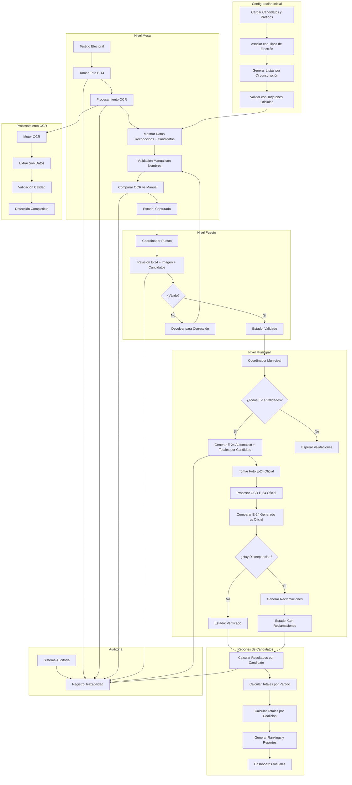
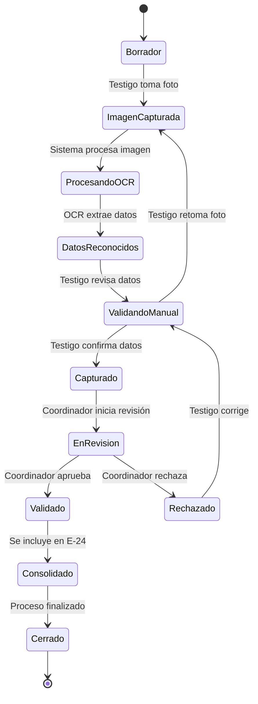
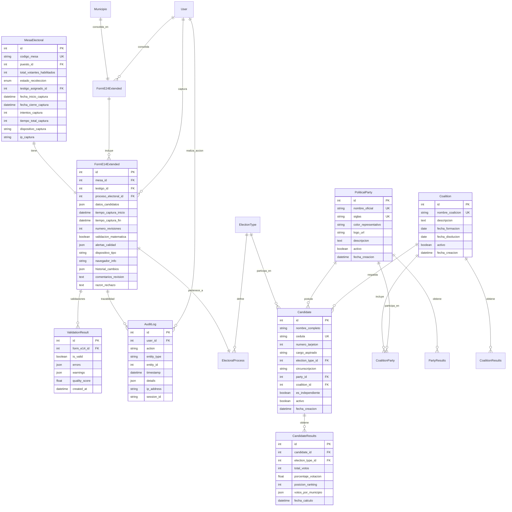

# Diseño - Recolección Inicial de Información de Votaciones

## Overview

El módulo de Recolección Inicial de Información de Votaciones implementará un flujo de trabajo optimizado para la captura, validación y consolidación de datos electorales. El diseño se enfoca en la eficiencia, trazabilidad y calidad de datos, utilizando una arquitectura basada en estados que garantiza la integridad del proceso desde la mesa electoral hasta la consolidación municipal.

### Principios de Diseño

- **Flujo Secuencial**: Proceso ordenado que no permite saltos de etapas
- **Validación Continua**: Verificación de datos en cada nivel del proceso
- **Trazabilidad Completa**: Registro detallado de cada acción y cambio
- **Recuperación Automática**: Capacidad de continuar procesos interrumpidos
- **Optimización Móvil**: Interfaz adaptada para dispositivos de campo

## Architecture

### Arquitectura del Flujo de Recolección con OCR y Seguimiento de Candidatos



### Arquitectura de Estados con OCR



## Components and Interfaces

### 1. Componente de Configuración Inicial y Tipos de Elecciones

#### InitializationService
```python
class InitializationService:
    def load_divipola_data(self, csv_path: str) -> bool:
        """Carga datos DIVIPOLA desde CSV y crea estructura jerárquica"""
        
    def create_electoral_structure(self) -> dict:
        """Crea mesas electorales basadas en datos DIVIPOLA"""
        
    def validate_geographic_hierarchy(self) -> ValidationResult:
        """Valida integridad de la jerarquía geográfica"""
        
    def generate_initialization_report(self) -> InitReport:
        """Genera reporte de configuración inicial"""

#### ElectionTypeService
```python
class ElectionTypeService:
    def create_election_type(self, name: str, template_config: dict) -> ElectionType:
        """Crea nuevo tipo de elección con su plantilla E-14"""
        
    def get_available_election_types(self) -> List[ElectionType]:
        """Obtiene todos los tipos de elecciones disponibles"""
        
    def create_electoral_journey(self, name: str, date: Date, election_types: List[int]) -> ElectoralJourney:
        """Crea jornada electoral con múltiples tipos de elecciones simultáneas"""
        
    def configure_simultaneous_elections(self, journey_id: int, election_configs: List[dict]) -> List[ElectoralProcess]:
        """Configura múltiples procesos electorales simultáneos para una jornada"""
        
    def assign_mesa_to_processes(self, mesa_id: int, process_ids: List[int]) -> List[MesaElectoralProcess]:
        """Asigna una mesa a múltiples procesos electorales simultáneos"""
        
    def validate_e14_template(self, template_config: dict) -> ValidationResult:
        """Valida configuración de plantilla E-14"""
        
    def generate_dynamic_form(self, process_id: int) -> FormStructure:
        """Genera estructura de formulario dinámico según proceso electoral específico"""
        
    def get_mesa_active_processes(self, mesa_id: int) -> List[ElectoralProcess]:
        """Obtiene todos los procesos electorales activos para una mesa específica"""

#### AnomalyService
```python
class AnomalyService:
    def create_anomaly_report(self, form_e14_id: int, description: str, category: str) -> AnomalyReport:
        """Crea reporte de anomalía asociado a un formulario E-14"""
        
    def classify_anomaly_automatically(self, description: str) -> AnomalyCategory:
        """Clasifica automáticamente la anomalía por categoría usando NLP básico"""
        
    def validate_anomaly_report(self, anomaly_id: int, coordinator_id: int, comments: str) -> bool:
        """Permite a coordinadores validar y comentar reportes de anomalías"""
        
    def generate_anomaly_alerts(self, anomaly_id: int) -> List[Alert]:
        """Genera alertas automáticas para anomalías críticas"""
        
    def consolidate_anomalies_by_location(self, location_id: int, location_type: str) -> AnomalyConsolidation:
        """Consolida reportes de anomalías por ubicación geográfica"""
        
    def generate_anomaly_statistics(self, filters: dict) -> AnomalyStatistics:
        """Genera estadísticas de anomalías por tipo, ubicación y gravedad"""
        
    def export_anomaly_reports(self, filters: dict) -> bytes:
        """Exporta reportes de anomalías para autoridades electorales"""

#### AdminPanelService
```python
class AdminPanelService:
    def configure_electoral_journey(self, config: JourneyConfig) -> ElectoralJourney:
        """Configura jornada electoral con múltiples elecciones simultáneas"""
        
    def upload_e14_template(self, election_type_id: int, template_file: bytes) -> E14Template:
        """Carga plantilla de formulario E-14 para tipo de elección específico"""
        
    def update_divipola_data(self, csv_file: bytes) -> DIVIPOLAUpdateResult:
        """Actualiza datos DIVIPOLA desde archivo CSV oficial"""
        
    def generate_system_reports(self, report_type: str, filters: dict) -> SystemReport:
        """Genera reportes administrativos del sistema"""
        
    def manage_system_messages(self, message: str, target_users: List[int]) -> MessageResult:
        """Gestiona mensajes generales del sistema para usuarios"""
        
    def get_system_statistics(self) -> SystemStatistics:
        """Obtiene estadísticas completas del sistema"""
        
    def manage_user_roles(self, user_id: int, roles: List[str]) -> UserManagementResult:
        """Gestiona roles y permisos de usuarios"""

#### WitnessManagementService
```python
class WitnessManagementService:
    def upload_witnesses_csv(self, csv_file: bytes, municipio_id: int) -> WitnessUploadResult:
        """Carga masiva de testigos desde archivo CSV"""
        
    def create_witness(self, witness_data: dict) -> Witness:
        """Crea un nuevo testigo electoral"""
        
    def assign_witness_to_mesa(self, witness_id: int, mesa_id: int) -> AssignmentResult:
        """Asigna un testigo a una mesa específica"""
        
    def reassign_witness(self, witness_id: int, from_mesa_id: int, to_mesa_id: int) -> ReassignmentResult:
        """Reasigna testigo de una mesa a otra del mismo puesto"""
        
    def get_witnesses_by_location(self, location_id: int, location_type: str) -> List[Witness]:
        """Obtiene testigos por ubicación geográfica"""
        
    def get_unassigned_witnesses(self, municipio_id: int) -> List[Witness]:
        """Obtiene testigos sin asignar en un municipio"""
        
    def validate_mesa_coverage(self, puesto_id: int) -> CoverageValidationResult:
        """Valida que todas las mesas del puesto tengan testigos asignados"""
        
    def generate_assignment_report(self, location_id: int, location_type: str) -> AssignmentReport:
        """Genera reporte de asignaciones por ubicación"""
        
    def bulk_assign_witnesses(self, assignments: List[dict]) -> BulkAssignmentResult:
        """Asigna múltiples testigos a mesas en una operación"""
        
    def get_witness_availability(self, witness_id: int) -> WitnessAvailability:
        """Obtiene disponibilidad actual de un testigo"""
        
    def update_witness_contact(self, witness_id: int, contact_data: dict) -> bool:
        """Actualiza información de contacto de un testigo"""
        
    def deactivate_witness(self, witness_id: int, reason: str) -> bool:
        """Desactiva un testigo por ausencia o incapacidad"""
        
    def assign_substitute_witness(self, mesa_id: int, main_witness_id: int, substitute_witness_id: int) -> SubstituteAssignmentResult:
        """Asigna testigo suplente a una mesa"""
        
    def activate_substitute(self, mesa_id: int, reason: str) -> ActivationResult:
        """Activa automáticamente testigo suplente cuando titular no se presenta"""
        
    def generate_witness_credentials(self, witness_id: int) -> WitnessCredentials:
        """Genera usuario y contraseña para acceso al sistema"""
        
    def send_credentials_notification(self, witness_id: int, methods: List[str]) -> NotificationResult:
        """Envía credenciales por SMS, email o WhatsApp"""
        
    def generate_qr_access_code(self, witness_id: int) -> QRCodeResult:
        """Genera código QR con credenciales para acceso rápido"""
        
    def search_witnesses(self, filters: dict, pagination: dict) -> WitnessSearchResult:
        """Búsqueda avanzada de testigos por múltiples criterios"""
        
    def get_assignment_history(self, witness_id: int) -> List[AssignmentHistory]:
        """Obtiene histórico completo de asignaciones de un testigo"""
        
    def bulk_generate_credentials(self, witness_ids: List[int]) -> BulkCredentialsResult:
        """Genera credenciales masivamente para múltiples testigos"""
        
    def validate_witness_credentials(self, username: str, password: str) -> CredentialValidationResult:
        """Valida credenciales de acceso de testigo"""
        
    def reset_witness_password(self, witness_id: int) -> PasswordResetResult:
        """Resetea contraseña de testigo y envía nueva por notificación"""
        
    def get_witnesses_without_credentials(self, municipio_id: int) -> List[Witness]:
        """Obtiene testigos que no tienen credenciales generadas"""

#### RoleBasedUIService
```python
class RoleBasedUIService:
    def get_user_interface_config(self, user_id: int, device_type: str) -> UIConfiguration:
        """Obtiene configuración de interfaz específica para el rol y dispositivo del usuario"""
        
    def get_available_actions(self, user_role: str, context: dict) -> List[ActionItem]:
        """Obtiene acciones disponibles para el rol específico en el contexto actual"""
        
    def get_navigation_menu(self, user_role: str, device_type: str) -> NavigationMenu:
        """Genera menú de navegación contextual para el rol y dispositivo"""
        
    def get_dashboard_widgets(self, user_role: str, user_id: int) -> List[DashboardWidget]:
        """Obtiene widgets de dashboard relevantes para el rol específico"""
        
    def filter_data_by_role(self, data: dict, user_role: str, user_context: dict) -> dict:
        """Filtra datos según permisos y relevancia del rol"""
        
    def get_quick_actions(self, user_role: str, current_context: dict) -> List[QuickAction]:
        """Obtiene acciones rápidas más utilizadas por el rol específico"""
        
    def validate_role_access(self, user_role: str, requested_action: str, context: dict) -> AccessValidationResult:
        """Valida si el rol tiene acceso a la acción solicitada"""
        
    def get_mobile_layout_config(self, user_role: str) -> MobileLayoutConfig:
        """Obtiene configuración de layout optimizada para móviles por rol"""
        
    def get_notification_preferences(self, user_role: str) -> NotificationPreferences:
        """Obtiene preferencias de notificaciones específicas del rol"""

#### PrintCenterService
```python
class PrintCenterService:
    def print_pdf_report(self, report_id: int, printer_config: dict) -> PrintResult:
        """Imprime informes PDF generados"""
        
    def print_photo_evidence(self, image_ids: List[int], layout: str) -> PrintResult:
        """Imprime evidencias fotográficas con layout específico"""
        
    def generate_print_queue(self, items: List[PrintItem]) -> PrintQueue:
        """Genera cola de impresión para múltiples documentos"""
        
    def get_available_printers(self) -> List[PrinterInfo]:
        """Obtiene lista de impresoras disponibles"""
        
    def configure_print_templates(self, template_config: dict) -> TemplateResult:
        """Configura plantillas de impresión personalizadas"""

#### SystemMessageService
```python
class SystemMessageService:
    def create_general_message(self, title: str, content: str, priority: str) -> SystemMessage:
        """Crea mensaje general del sistema"""
        
    def broadcast_message(self, message_id: int, target_roles: List[str]) -> BroadcastResult:
        """Difunde mensaje a usuarios específicos por rol"""
        
    def schedule_message(self, message_id: int, schedule_time: DateTime) -> ScheduleResult:
        """Programa mensaje para envío automático"""
        
    def get_message_status(self, message_id: int) -> MessageStatus:
        """Obtiene estado de entrega de mensajes"""

#### CandidateManagementService
```python
class CandidateManagementService:
    def create_political_party(self, party_data: dict) -> PoliticalParty:
        """Crea un nuevo partido político"""
        
    def create_coalition(self, coalition_data: dict, party_ids: List[int]) -> Coalition:
        """Crea una nueva coalición con partidos asociados"""
        
    def create_candidate(self, candidate_data: dict) -> Candidate:
        """Crea un nuevo candidato electoral"""
        
    def associate_candidate_with_party(self, candidate_id: int, party_id: int) -> bool:
        """Asocia un candidato con un partido político"""
        
    def associate_candidate_with_coalition(self, candidate_id: int, coalition_id: int) -> bool:
        """Asocia un candidato con una coalición"""
        
    def upload_candidates_csv(self, csv_file: bytes, election_type_id: int) -> CandidateUploadResult:
        """Carga masiva de candidatos desde archivo CSV"""
        
    def validate_candidate_data(self, candidate_data: dict) -> ValidationResult:
        """Valida datos de candidato antes de crear"""
        
    def check_duplicate_candidates(self, candidate_data: dict, election_type_id: int) -> DuplicateCheckResult:
        """Verifica candidatos duplicados para mismo cargo y elección"""
        
    def generate_candidate_list(self, election_type_id: int, circunscripcion_id: int = None) -> CandidateList:
        """Genera lista de candidatos organizada por partido/coalición"""
        
    def search_candidates(self, filters: dict) -> CandidateSearchResult:
        """Búsqueda y filtrado de candidatos por múltiples criterios"""
        
    def get_candidates_by_party(self, party_id: int, election_type_id: int = None) -> List[Candidate]:
        """Obtiene candidatos de un partido específico"""
        
    def get_candidates_by_coalition(self, coalition_id: int, election_type_id: int = None) -> List[Candidate]:
        """Obtiene candidatos de una coalición específica"""
        
    def validate_ballot_consistency(self, election_type_id: int, ballot_data: dict) -> BallotValidationResult:
        """Valida que candidatos coincidan con tarjetón electoral oficial"""
        
    def update_candidate_info(self, candidate_id: int, updated_data: dict) -> bool:
        """Actualiza información de un candidato"""
        
    def deactivate_candidate(self, candidate_id: int, reason: str) -> bool:
        """Desactiva un candidato del proceso electoral"""
        
    def get_candidate_history(self, candidate_id: int) -> List[CandidateHistory]:
        """Obtiene histórico de participaciones electorales del candidato"""
        
    def configure_circunscripcion_candidates(self, circunscripcion_config: dict) -> CircunscripcionResult:
        """Configura diferentes listas de candidatos por circunscripción"""
        
    def export_candidate_data(self, filters: dict, format: str) -> bytes:
        """Exporta datos de candidatos en formato especificado"""

#### CandidateReportingService
```python
class CandidateReportingService:
    def calculate_candidate_results(self, candidate_id: int, location_filters: dict = None) -> CandidateResults:
        """Calcula resultados de votación para un candidato específico"""
        
    def calculate_party_results(self, party_id: int, location_filters: dict = None) -> PartyResults:
        """Calcula resultados totales de un partido sumando todos sus candidatos"""
        
    def calculate_coalition_results(self, coalition_id: int, location_filters: dict = None) -> CoalitionResults:
        """Calcula resultados totales de una coalición sumando todos sus partidos"""
        
    def generate_candidate_ranking(self, election_type_id: int, location_filters: dict = None) -> CandidateRanking:
        """Genera ranking de candidatos por votación"""
        
    def generate_party_ranking(self, election_type_id: int, location_filters: dict = None) -> PartyRanking:
        """Genera ranking de partidos por votación total"""
        
    def generate_detailed_candidate_report(self, candidate_id: int) -> DetailedCandidateReport:
        """Genera reporte detallado de resultados por candidato"""
        
    def generate_comparative_party_report(self, party_ids: List[int]) -> ComparativePartyReport:
        """Genera reporte comparativo entre partidos"""
        
    def calculate_vote_percentages(self, results_data: dict, total_valid_votes: int) -> dict:
        """Calcula porcentajes de votación para candidatos/partidos"""
        
    def generate_geographic_distribution_report(self, candidate_id: int) -> GeographicDistributionReport:
        """Genera reporte de distribución geográfica de votos por candidato"""
        
    def create_visual_dashboard_data(self, election_type_id: int) -> DashboardData:
        """Crea datos para dashboards visuales con gráficos de resultados"""
        
    def export_results_report(self, report_config: dict, format: str) -> bytes:
        """Exporta reportes de resultados en formato especificado"""
        
    def get_historical_comparison(self, candidate_id: int, previous_elections: List[int]) -> HistoricalComparison:
        """Compara resultados actuales con elecciones anteriores"""

#### WitnessAlertService
```python
class WitnessAlertService:
    def detect_orphan_mesas(self, puesto_id: int) -> List[MesaElectoral]:
        """Detecta mesas sin testigo asignado o con testigo inactivo"""
        
    def generate_witness_alert(self, mesa_id: int, alert_type: str) -> WitnessAlert:
        """Genera alerta automática para testigo faltante"""
        
    def notify_available_witnesses(self, puesto_id: int, mesa_id: int) -> NotificationResult:
        """Notifica a testigos disponibles sobre mesa que necesita cobertura"""
        
    def calculate_puesto_coverage(self, puesto_id: int) -> CoverageReport:
        """Calcula porcentaje de cobertura de testigos en tiempo real"""
        
    def accept_mesa_coverage(self, testigo_id: int, mesa_id: int) -> CoverageResult:
        """Permite a testigo aceptar cobertura de mesa huérfana"""
        
    def send_push_notification(self, user_ids: List[int], message: str, data: dict) -> PushResult:
        """Envía notificaciones push a dispositivos móviles"""
        
    def send_sms_alert(self, phone_numbers: List[str], message: str) -> SMSResult:
        """Envía alertas SMS a testigos"""
        
    def send_email_alert(self, emails: List[str], subject: str, message: str) -> EmailResult:
        """Envía alertas por email a testigos"""
        
    def update_map_markers_for_orphans(self, mesa_ids: List[int]) -> MapUpdateResult:
        """Actualiza marcadores del mapa para mostrar mesas huérfanas"""
        
    def generate_coverage_report(self, location_id: int, location_type: str) -> CoverageReport:
        """Genera reporte de cobertura por puesto o municipio"""
        
    def escalate_critical_coverage(self, puesto_id: int, coverage_percentage: float) -> EscalationResult:
        """Escala alertas a coordinadores municipales cuando cobertura es crítica"""
        
    def get_alert_history(self, filters: dict) -> List[WitnessAlert]:
        """Obtiene histórico de alertas para auditoría"""
        
    def mark_alert_resolved(self, alert_id: int, resolution_notes: str) -> bool:
        """Marca alerta como resuelta con notas de resolución"""

#### MapService
```python
class MapService:
    def initialize_map_data(self, divipola_data: List[dict]) -> MapInitResult:
        """Inicializa datos del mapa con coordenadas de ubicaciones electorales"""
        
    def get_map_markers(self, filters: dict) -> List[MapMarker]:
        """Obtiene marcadores del mapa filtrados por criterios específicos"""
        
    def update_marker_status(self, mesa_id: int, status: str) -> MarkerUpdateResult:
        """Actualiza estado de marcador de mesa en tiempo real"""
        
    def get_user_location(self, user_id: int) -> UserLocation:
        """Obtiene ubicación actual del usuario mediante GPS"""
        
    def calculate_route(self, origin: Coordinates, destination: Coordinates) -> RouteResult:
        """Calcula ruta desde ubicación actual hasta mesa específica"""
        
    def search_locations(self, query: str, location_type: str) -> List[LocationResult]:
        """Busca ubicaciones por nombre, código o dirección"""
        
    def get_nearby_mesas(self, coordinates: Coordinates, radius_km: float) -> List[MesaElectoral]:
        """Obtiene mesas cercanas a una ubicación específica"""
        
    def generate_map_statistics(self, area_id: int) -> MapStatistics:
        """Genera estadísticas geográficas por área específica"""
        
    def generate_heatmap_data(self, metric_type: str, area_level: str) -> HeatmapData:
        """Genera datos de mapa de calor basado en métricas específicas"""
        
    def calculate_progress_density(self, coordinates: List[Coordinates], progress_data: List[dict]) -> List[HeatmapPoint]:
        """Calcula densidad de progreso para puntos geográficos específicos"""
        
    def get_heatmap_by_metric(self, metric: str, filters: dict) -> HeatmapLayer:
        """Obtiene capa de mapa de calor para métrica específica (completitud, participación, anomalías, tiempo)"""
        
    def update_heatmap_realtime(self, area_updates: List[dict]) -> HeatmapUpdateResult:
        """Actualiza mapa de calor en tiempo real cuando cambian los datos"""
        
    def export_heatmap_image(self, heatmap_config: dict) -> bytes:
        """Exporta imagen del mapa de calor para reportes"""
```

#### Modelos de Tipos de Elecciones
```python
class ElectionType(BaseModel):
    nombre: String(100) [unique, indexed]
    descripcion: Text
    codigo: String(20) [unique, indexed]
    plantilla_e14: JSON  # Configuración de campos del formulario
    activo: Boolean [default=True]
    
    # Configuración OCR específica
    ocr_template_config: JSON  # Configuración específica para OCR
    validation_rules: JSON  # Reglas de validación específicas
    
class ElectoralJourney(BaseModel):
    nombre: String(200)
    fecha_jornada: Date [indexed]
    descripcion: Text
    estado: Enum(JourneyStatus) [indexed]
    activo: Boolean [default=True]

class ElectoralProcess(BaseModel):
    nombre: String(200)
    jornada_electoral_id: ForeignKey(ElectoralJourney) [indexed]
    election_type_id: ForeignKey(ElectionType) [indexed]
    fecha_inicio: DateTime
    fecha_fin: DateTime
    estado: Enum(ProcessStatus) [indexed]
    
    # Configuración específica del proceso
    configuracion: JSON
    activo: Boolean [default=True]

#### Modelo Mesa Electoral Extendido
```python
class MesaElectoral(BaseModel):
    # Campos básicos de Location
    codigo_mesa: String(20) [unique, indexed]
    puesto_id: ForeignKey(Location)
    total_votantes_habilitados: Integer
    
    # Relación con jornada electoral
    jornada_electoral_id: ForeignKey(ElectoralJourney) [indexed]
    
    # Campos específicos para recolección
    estado_recoleccion: Enum(EstadoRecoleccion) [indexed]
    testigo_asignado_id: ForeignKey(User)
    fecha_inicio_captura: DateTime
    fecha_cierre_captura: DateTime
    
    # Metadatos de proceso
    intentos_captura: Integer [default=0]
    tiempo_total_captura: Integer  # en segundos
    dispositivo_captura: String(100)
    ip_captura: String(45)

#### Modelo de Relación Mesa-Proceso Electoral
```python
class MesaElectoralProcess(BaseModel):
    mesa_id: ForeignKey(MesaElectoral) [indexed]
    proceso_electoral_id: ForeignKey(ElectoralProcess) [indexed]
    estado_proceso: Enum(ProcessStatus) [indexed]
    fecha_asignacion: DateTime
    
    # Constraint: Una mesa puede tener múltiples procesos electorales simultáneos
    # pero solo uno por tipo de elección
    __table_args__ = (UniqueConstraint('mesa_id', 'proceso_electoral_id'),)
```

### 2. Componente de Captura E-14 con OCR

#### FormE14CaptureService
```python
class FormE14CaptureService:
    def create_e14_form(self, mesa_id: int, testigo_id: int) -> FormE14:
        """Crea nuevo formulario E-14 con validaciones iniciales"""
        
    def process_e14_image(self, image_data: bytes, mesa_id: int) -> OCRResult:
        """Procesa imagen del E-14 físico usando OCR"""
        
    def validate_mathematical_consistency(self, form_data: dict) -> ValidationResult:
        """Valida consistencia matemática de los datos"""
        
    def compare_ocr_manual_data(self, ocr_data: dict, manual_data: dict) -> ComparisonResult:
        """Compara datos reconocidos por OCR con datos ingresados manualmente"""
        
    def generate_coincidence_text(self, comparison_result: ComparisonResult) -> CoincidenceText:
        """Genera texto automático informando el nivel de coincidencia entre OCR y datos manuales"""
        
    def calculate_coincidence_percentage(self, ocr_data: dict, manual_data: dict) -> float:
        """Calcula porcentaje de coincidencia entre datos OCR y manuales"""
        
    def auto_save_progress(self, form_id: int, data: dict) -> bool:
        """Guarda progreso automáticamente cada 30 segundos"""
        
    def detect_duplicate_submission(self, mesa_id: int) -> bool:
        """Detecta intentos de duplicar formularios"""
```

#### OCRService
```python
class OCRService:
    def extract_data_from_e14(self, image: bytes) -> OCRResult:
        """Extrae datos numéricos del formulario E-14 usando OCR"""
        
    def validate_image_quality(self, image: bytes) -> ImageQualityResult:
        """Valida calidad de imagen para procesamiento OCR"""
        
    def detect_form_completeness(self, image: bytes) -> CompletenessResult:
        """Detecta si el formulario está completamente lleno"""
        
    def enhance_image_for_ocr(self, image: bytes) -> bytes:
        """Mejora calidad de imagen para mejor reconocimiento"""
```

#### Modelo FormE14 Extendido
```python
class FormE14Extended(FormE14):
    # Relación con proceso electoral específico
    proceso_electoral_id: ForeignKey(ElectoralProcess) [indexed]
    mesa_electoral_process_id: ForeignKey(MesaElectoralProcess) [indexed]
    
    # Datos dinámicos según tipo de elección
    datos_formulario: JSON  # Datos específicos según plantilla del tipo de elección
    
    # Campos adicionales para recolección
    tiempo_captura_inicio: DateTime
    tiempo_captura_fin: DateTime
    numero_revisiones: Integer [default=0]
    
    # Campos de imagen y OCR
    imagen_e14_original: LargeBinary  # Imagen del formulario físico
    imagen_e14_url: String(500)  # URL de la imagen almacenada
    datos_ocr_extraidos: JSON  # Datos reconocidos por OCR
    confianza_ocr: Float  # Nivel de confianza del OCR (0-1)
    
    # Campo obligatorio de anomalías
    reporte_anomalias: Text [required]  # Descripción de anomalías observadas por el testigo
    tiene_anomalias: Boolean [default=False]  # Indica si se reportaron anomalías
    
    # Texto automático de coincidencia OCR vs Manual
    texto_coincidencia: Text  # Mensaje automático sobre coincidencia de datos
    porcentaje_coincidencia: Float  # Porcentaje de coincidencia (0-100)
    nivel_coincidencia: Enum(CoincidenceLevel)  # Nivel: ALTA, MEDIA, BAJA, CRITICA
    
    # Validaciones automáticas
    validacion_matematica: Boolean [default=False]
    validacion_ocr_manual: Boolean [default=False]  # Comparación OCR vs manual
    alertas_calidad: JSON  # Array de alertas detectadas
    
    # Metadatos de dispositivo
    dispositivo_tipo: String(50)
    navegador_info: String(200)
    resolucion_pantalla: String(20)
    
    # Campos de trazabilidad
    historial_cambios: JSON  # Array de cambios con timestamps
    comentarios_revision: Text
    razon_rechazo: Text
    
    # Metadatos de imagen
    calidad_imagen: Float  # Calidad de la imagen (0-1)
    completitud_formulario: Boolean  # Si el formulario físico está completo
```

### 3. Componente de Validación y Supervisión

#### ValidationService
```python
class ValidationService:
    def perform_cross_validation(self, form_e14: FormE14) -> ValidationResult:
        """Realiza validaciones cruzadas del formulario"""
        
    def detect_anomalies(self, form_e14: FormE14, similar_mesas: List[MesaElectoral]) -> List[Anomaly]:
        """Detecta valores atípicos comparando con mesas similares"""
        
    def generate_quality_report(self, puesto_id: int) -> QualityReport:
        """Genera reporte de calidad de datos por puesto"""
        
    def approve_form(self, form_id: int, coordinator_id: int, comments: str) -> bool:
        """Aprueba formulario con comentarios del coordinador"""
```

#### Modelo de Validación
```python
class ValidationResult:
    is_valid: Boolean
    errors: List[ValidationError]
    warnings: List[ValidationWarning]
    quality_score: Float  # 0-100
    
class ValidationError:
    code: String(20)
    message: String(500)
    field: String(100)
    severity: Enum(Severity)
    
class Anomaly:
    type: Enum(AnomalyType)  # STATISTICAL, MATHEMATICAL, TEMPORAL
    description: String(500)
    confidence: Float  # 0-1
    suggested_action: String(200)

#### Modelos de OCR
```python
class OCRResult:
    success: Boolean
    confidence: Float  # 0-1
    extracted_data: dict  # Datos extraídos del formulario
    processing_time: Float  # Tiempo de procesamiento en segundos
    errors: List[OCRError]
    
class OCRError:
    code: String(20)
    message: String(500)
    field: String(100)
    confidence: Float
    
class ImageQualityResult:
    is_acceptable: Boolean
    quality_score: Float  # 0-1
    issues: List[ImageIssue]
    
class ImageIssue:
    type: Enum(ImageIssueType)  # BLUR, LOW_LIGHT, ANGLE, INCOMPLETE
    severity: Enum(Severity)
    description: String(200)
    
class ComparisonResult:
    matches: dict  # Campos que coinciden entre OCR y manual
    discrepancies: dict  # Campos con diferencias
    confidence_score: Float  # 0-1
    requires_review: Boolean

#### Modelos de Texto de Coincidencia
```python
class CoincidenceText:
    texto_generado: String(500)  # Mensaje automático generado
    porcentaje_coincidencia: Float  # 0-100
    nivel_coincidencia: Enum(CoincidenceLevel)
    campos_coincidentes: Integer
    campos_diferentes: Integer
    total_campos: Integer
    timestamp_generacion: DateTime
```

#### Modelos de Verificación E-24
```python
class E24Discrepancy:
    field_name: String(100)
    generated_value: String(200)
    official_value: String(200)
    difference: Float
    percentage_difference: Float
    severity: Enum(DiscrepancySeverity)
    
class ClaimsReport:
    e24_id: Integer
    municipio_info: dict
    total_discrepancies: Integer
    critical_discrepancies: Integer
    evidence_urls: List[String]
    generated_date: DateTime
    coordinator_id: Integer
    
class DiscrepancySeverity(Enum):
    MINOR = "menor"  # Diferencias < 1%
    MODERATE = "moderada"  # Diferencias 1-5%
    MAJOR = "mayor"  # Diferencias 5-10%
    CRITICAL = "critica"  # Diferencias > 10%

#### Modelos de Anomalías
```python
class AnomalyReport(BaseModel):
    form_e14_id: ForeignKey(FormE14Extended) [indexed]
    testigo_id: ForeignKey(User) [indexed]
    descripcion: Text [required]
    categoria: Enum(AnomalyCategory) [indexed]
    gravedad: Enum(AnomalySeverity) [indexed]
    
    # Validación por coordinadores
    validado_por: ForeignKey(User)
    fecha_validacion: DateTime
    comentarios_coordinador: Text
    estado: Enum(AnomalyStatus) [indexed]
    
    # Acciones tomadas
    acciones_tomadas: Text
    requiere_escalamiento: Boolean [default=False]
    
class AnomalyConsolidation(BaseModel):
    location_id: ForeignKey(Location) [indexed]
    location_type: Enum(LocationType) [indexed]
    total_anomalias: Integer
    anomalias_por_categoria: JSON
    anomalias_criticas: Integer
    fecha_consolidacion: DateTime
    
class AnomalyStatistics:
    total_reportes: Integer
    por_categoria: dict
    por_gravedad: dict
    por_ubicacion: dict
    tendencias_temporales: dict

#### Modelos de Informes PDF
```python
class PDFReport(BaseModel):
    tipo_reporte: Enum(ReportType) [indexed]
    ubicacion_id: ForeignKey(Location) [indexed]
    generado_por: ForeignKey(User) [indexed]
    fecha_generacion: DateTime [indexed]
    
    # Contenido del reporte
    datos_incluidos: JSON  # Datos consolidados incluidos en el reporte
    estadisticas: JSON  # Estadísticas calculadas
    anomalias_incluidas: JSON  # Anomalías reportadas incluidas
    
    # Archivo PDF
    archivo_pdf: LargeBinary  # Contenido del PDF
    archivo_pdf_url: String(500)  # URL del archivo almacenado
    tamaño_archivo: Integer  # Tamaño en bytes
    
    # Metadatos
    total_formularios_incluidos: Integer
    total_mesas_incluidas: Integer
    hash_integridad: String(64)  # Hash para verificar integridad
    
class ReportStatistics:
    total_votantes_habilitados: Integer
    total_votos_validos: Integer
    total_votos_nulos: Integer
    total_votos_blancos: Integer
    porcentaje_participacion: Float
    tiempo_promedio_captura: Float
    anomalias_reportadas: Integer
    discrepancias_detectadas: Integer

#### Modelos de Administración
```python
class E14Template(BaseModel):
    election_type_id: ForeignKey(ElectionType) [indexed]
    nombre_plantilla: String(200)
    archivo_plantilla: LargeBinary  # Archivo de plantilla
    archivo_plantilla_url: String(500)
    configuracion_campos: JSON  # Configuración de campos del formulario
    configuracion_ocr: JSON  # Configuración específica de OCR
    version: String(20)
    activo: Boolean [default=True]
    creado_por: ForeignKey(User)
    fecha_creacion: DateTime

class SystemMessage(BaseModel):
    titulo: String(200) [indexed]
    contenido: Text
    prioridad: Enum(MessagePriority) [indexed]
    tipo: Enum(MessageType) [indexed]
    
    # Configuración de envío
    roles_objetivo: JSON  # Roles a los que se envía
    usuarios_objetivo: JSON  # Usuarios específicos
    fecha_programada: DateTime
    
    # Estado del mensaje
    estado: Enum(MessageStatus) [indexed]
    enviado_por: ForeignKey(User)
    fecha_creacion: DateTime
    fecha_envio: DateTime
    
class PrintQueue(BaseModel):
    nombre_trabajo: String(200)
    tipo_documento: Enum(DocumentType) [indexed]
    documento_ids: JSON  # IDs de documentos a imprimir
    configuracion_impresion: JSON
    
    # Estado de impresión
    estado: Enum(PrintStatus) [indexed]
    impresora_asignada: String(100)
    solicitado_por: ForeignKey(User)
    fecha_solicitud: DateTime
    fecha_impresion: DateTime
    
class SystemStatistics:
    total_jornadas_configuradas: Integer
    total_procesos_electorales: Integer
    total_mesas_activas: Integer
    total_usuarios_activos: Integer
    total_formularios_procesados: Integer
    total_anomalias_reportadas: Integer
    total_informes_generados: Integer
    tiempo_promedio_procesamiento: Float
    ultima_actualizacion: DateTime

#### Modelos de Mapas y Geolocalización
```python
class MapMarker(BaseModel):
    mesa_id: ForeignKey(MesaElectoral) [indexed]
    latitud: Float [required]
    longitud: Float [required]
    titulo: String(200)
    descripcion: Text
    estado_visual: Enum(MarkerStatus) [indexed]
    color_marcador: String(20)
    icono_tipo: String(50)
    
    # Información adicional
    direccion_completa: String(500)
    total_votantes: Integer
    progreso_captura: Float  # Porcentaje 0-100
    ultima_actualizacion: DateTime

class UserLocation(BaseModel):
    user_id: ForeignKey(User) [indexed]
    latitud: Float [required]
    longitud: Float [required]
    precision: Float  # Precisión en metros
    timestamp: DateTime [indexed]
    dispositivo_tipo: String(50)
    
class RouteResult:
    distancia_km: Float
    tiempo_estimado_minutos: Integer
    coordenadas_ruta: JSON  # Array de coordenadas para dibujar ruta
    instrucciones: List[String]
    
class MapStatistics:
    total_marcadores: Integer
    marcadores_por_estado: dict
    area_cobertura_km2: Float
    densidad_mesas_por_km2: Float
    centro_geografico: dict  # {lat, lng}

#### Modelos de Mapa de Calor
```python
class HeatmapData(BaseModel):
    metric_type: Enum(HeatmapMetric) [indexed]
    area_level: Enum(AreaLevel) [indexed]  # MESA, PUESTO, MUNICIPIO, DEPARTAMENTO
    generated_at: DateTime [indexed]
    data_points: JSON  # Array de puntos con coordenadas e intensidad
    
    # Configuración visual
    color_gradient: JSON  # Configuración de gradiente de colores
    intensity_range: dict  # {min: 0, max: 100}
    opacity: Float  # 0.0 - 1.0
    
class HeatmapPoint:
    latitud: Float [required]
    longitud: Float [required]
    intensidad: Float  # 0.0 - 1.0
    valor_real: Float  # Valor real de la métrica
    area_id: Integer  # ID del área (mesa, puesto, municipio)
    area_nombre: String(200)
    
class HeatmapLayer:
    layer_id: String(50) [unique]
    nombre: String(200)
    descripcion: Text
    metric_type: Enum(HeatmapMetric)
    puntos: List[HeatmapPoint]
    configuracion_visual: dict
    activo: Boolean [default=True]
    
class ProgressDensity:
    area_id: Integer
    area_type: Enum(AreaLevel)
    total_mesas: Integer
    mesas_completadas: Integer
    porcentaje_completitud: Float
    densidad_geografica: Float  # Mesas por km²
    tiempo_promedio_procesamiento: Float
    anomalias_reportadas: Integer

#### Modelos de Alertas para Testigos Faltantes
```python
class WitnessAlert(BaseModel):
    mesa_id: ForeignKey(MesaElectoral) [indexed]
    puesto_id: ForeignKey(Location) [indexed]
    alert_type: Enum(AlertType) [indexed]
    priority: Enum(AlertPriority) [indexed]
    
    # Detalles de la alerta
    title: String(200)
    message: Text
    created_at: DateTime [indexed]
    
    # Estado de la alerta
    status: Enum(AlertStatus) [indexed]
    resolved_at: DateTime
    resolved_by: ForeignKey(User)
    resolution_notes: Text
    
    # Notificaciones enviadas
    notifications_sent: JSON  # Array de notificaciones enviadas
    witnesses_notified: JSON  # Array de testigos notificados
    
class CoverageReport(BaseModel):
    location_id: ForeignKey(Location) [indexed]
    location_type: Enum(LocationType) [indexed]
    report_date: DateTime [indexed]
    
    # Métricas de cobertura
    total_mesas: Integer
    mesas_con_testigo: Integer
    mesas_huerfanas: Integer
    porcentaje_cobertura: Float
    
    # Detalles por estado
    testigos_activos: Integer
    testigos_inactivos: Integer
    testigos_disponibles: Integer
    
    # Alertas generadas
    alertas_generadas: Integer
    alertas_resueltas: Integer
    alertas_pendientes: Integer
    
class WitnessAvailability(BaseModel):
    testigo_id: ForeignKey(User) [indexed]
    puesto_id: ForeignKey(Location) [indexed]
    
    # Estado de disponibilidad
    is_available: Boolean [default=True]
    current_mesa_id: ForeignKey(MesaElectoral)
    can_cover_additional: Boolean [default=False]
    
    # Ubicación y contacto
    last_known_location: JSON  # {lat, lng, timestamp}
    phone_number: String(20)
    email: String(100)
    preferred_contact_method: Enum(ContactMethod)
    
    # Historial de cobertura
    mesas_covered_today: JSON  # Array de mesas cubiertas
    total_coverage_time: Integer  # Tiempo total en minutos
    
class NotificationResult:
    success: Boolean
    notifications_sent: Integer
    failed_notifications: Integer
    witnesses_reached: List[Integer]  # IDs de testigos contactados
    delivery_methods: dict  # {push: 5, sms: 3, email: 2}
    
class CoverageResult:
    success: Boolean
    previous_testigo_id: Integer
    new_testigo_id: Integer
    coverage_start_time: DateTime
    estimated_coverage_duration: Integer  # minutos
    
class EscalationResult:
    escalated: Boolean
    escalation_level: Enum(EscalationLevel)
    coordinators_notified: List[Integer]
    escalation_message: String(500)
    escalation_timestamp: DateTime

#### Modelos de Gestión de Testigos
```python
class Witness(BaseModel):
    # Información personal
    nombre_completo: String(200) [required, indexed]
    cedula: String(20) [unique, indexed]
    telefono: String(20) [indexed]
    email: String(100) [indexed]
    
    # Ubicación asignada
    municipio_id: ForeignKey(Location) [indexed]
    puesto_id: ForeignKey(Location) [indexed]
    mesa_asignada_id: ForeignKey(MesaElectoral) [indexed]
    
    # Estado del testigo
    estado: Enum(WitnessStatus) [indexed]
    fecha_asignacion: DateTime
    fecha_ultima_actividad: DateTime
    
    # Información adicional
    observaciones: Text
    metodo_contacto_preferido: Enum(ContactMethod)
    activo: Boolean [default=True]
    
    # Metadatos
    creado_por: ForeignKey(User)
    fecha_creacion: DateTime
    fecha_actualizacion: DateTime

class WitnessAssignment(BaseModel):
    witness_id: ForeignKey(Witness) [indexed]
    mesa_id: ForeignKey(MesaElectoral) [indexed]
    assigned_by: ForeignKey(User) [indexed]
    assignment_date: DateTime [indexed]
    
    # Estado de la asignación
    status: Enum(AssignmentStatus) [indexed]
    start_time: DateTime
    end_time: DateTime
    
    # Historial
    previous_assignment_id: ForeignKey(WitnessAssignment)
    reassignment_reason: Text
    
    # Constraint: Un testigo solo puede estar asignado a una mesa activa a la vez
    __table_args__ = (UniqueConstraint('witness_id', 'status'),)

class WitnessUploadResult:
    total_records: Integer
    successful_imports: Integer
    failed_imports: Integer
    errors: List[dict]  # Array de errores con detalles
    witnesses_created: List[Integer]  # IDs de testigos creados
    
class AssignmentResult:
    success: Boolean
    witness_id: Integer
    mesa_id: Integer
    previous_witness_id: Integer  # Si había testigo anterior
    assignment_id: Integer
    message: String(500)
    
class ReassignmentResult:
    success: Boolean
    witness_id: Integer
    from_mesa_id: Integer
    to_mesa_id: Integer
    reassignment_reason: String(500)
    effective_date: DateTime
    
class CoverageValidationResult:
    puesto_id: Integer
    total_mesas: Integer
    mesas_con_testigo: Integer
    mesas_sin_testigo: Integer
    coverage_percentage: Float
    missing_assignments: List[Integer]  # IDs de mesas sin testigo
    validation_passed: Boolean
    
class AssignmentReport:
    location_info: dict  # Información de la ubicación
    total_witnesses: Integer
    assigned_witnesses: Integer
    unassigned_witnesses: Integer
    total_mesas: Integer
    covered_mesas: Integer
    uncovered_mesas: Integer
    assignments_by_puesto: dict
    witness_details: List[dict]
    generated_at: DateTime
    
class BulkAssignmentResult:
    total_assignments: Integer
    successful_assignments: Integer
    failed_assignments: Integer
    assignment_results: List[AssignmentResult]
    validation_errors: List[dict]

class WitnessCredentials(BaseModel):
    witness_id: ForeignKey(Witness) [indexed]
    username: String(50) [unique, indexed]
    password_hash: String(255)
    password_plain: String(20)  # Solo para envío inicial, se limpia después
    
    # Estado de credenciales
    is_active: Boolean [default=True]
    first_login: Boolean [default=False]
    last_login: DateTime
    login_attempts: Integer [default=0]
    
    # Notificaciones enviadas
    credentials_sent_sms: Boolean [default=False]
    credentials_sent_email: Boolean [default=False]
    credentials_sent_whatsapp: Boolean [default=False]
    
    # QR Code
    qr_code_data: Text  # Datos codificados en QR
    qr_code_image_url: String(500)  # URL de imagen QR generada
    
    # Metadatos
    generated_by: ForeignKey(User)
    generated_at: DateTime
    expires_at: DateTime

class SubstituteWitness(BaseModel):
    main_witness_id: ForeignKey(Witness) [indexed]
    substitute_witness_id: ForeignKey(Witness) [indexed]
    mesa_id: ForeignKey(MesaElectoral) [indexed]
    
    # Estado del suplente
    is_active: Boolean [default=False]
    activation_reason: Text
    activated_by: ForeignKey(User)
    activation_date: DateTime
    
    # Prioridad (en caso de múltiples suplentes)
    priority_order: Integer [default=1]
    
    # Constraint: Un suplente puede estar asignado a múltiples mesas pero con prioridades diferentes
    __table_args__ = (UniqueConstraint('substitute_witness_id', 'mesa_id'),)

class AssignmentHistory(BaseModel):
    witness_id: ForeignKey(Witness) [indexed]
    mesa_id: ForeignKey(MesaElectoral) [indexed]
    action_type: Enum(AssignmentAction) [indexed]
    
    # Detalles de la acción
    action_date: DateTime [indexed]
    performed_by: ForeignKey(User)
    reason: Text
    
    # Datos antes y después del cambio
    previous_data: JSON
    new_data: JSON
    
    # Contexto adicional
    session_id: String(100)
    ip_address: String(45)

class WitnessSearchResult:
    total_results: Integer
    page: Integer
    per_page: Integer
    total_pages: Integer
    witnesses: List[Witness]
    filters_applied: dict
    search_time_ms: Integer

class SubstituteAssignmentResult:
    success: Boolean
    main_witness_id: Integer
    substitute_witness_id: Integer
    mesa_id: Integer
    priority_order: Integer
    message: String(500)

class ActivationResult:
    success: Boolean
    mesa_id: Integer
    previous_witness_id: Integer
    activated_witness_id: Integer
    activation_reason: String(500)
    activation_timestamp: DateTime

class QRCodeResult:
    success: Boolean
    witness_id: Integer
    qr_code_data: String(1000)
    qr_code_image_url: String(500)
    expires_at: DateTime

class BulkCredentialsResult:
    total_witnesses: Integer
    credentials_generated: Integer
    credentials_failed: Integer
    notifications_sent: Integer
    results: List[dict]  # Detalles por testigo

class CredentialValidationResult:
    is_valid: Boolean
    witness_id: Integer
    mesa_assigned: dict  # Información de mesa asignada
    permissions: List[String]
    last_login: DateTime
    requires_password_change: Boolean

class PasswordResetResult:
    success: Boolean
    witness_id: Integer
    new_password: String(20)
    notification_sent: Boolean
    reset_timestamp: DateTime

#### Modelos de Candidatos y Partidos Políticos
```python
class PoliticalParty(BaseModel):
    nombre_oficial: String(200) [required, indexed]
    siglas: String(20) [unique, indexed]
    color_representativo: String(7)  # Código hexadecimal de color
    logo_url: String(500)  # URL del logo del partido
    
    # Información adicional
    descripcion: Text
    fundacion_year: Integer
    ideologia: String(100)
    
    # Estado
    activo: Boolean [default=True]
    reconocido_oficialmente: Boolean [default=True]
    
    # Metadatos
    creado_por: ForeignKey(User)
    fecha_creacion: DateTime
    fecha_actualizacion: DateTime

class Coalition(BaseModel):
    nombre_coalicion: String(200) [required, indexed]
    descripcion: Text
    fecha_formacion: Date
    fecha_disolucion: Date
    
    # Estado
    activo: Boolean [default=True]
    
    # Metadatos
    creado_por: ForeignKey(User)
    fecha_creacion: DateTime
    fecha_actualizacion: DateTime

class CoalitionParty(BaseModel):
    coalition_id: ForeignKey(Coalition) [indexed]
    party_id: ForeignKey(PoliticalParty) [indexed]
    fecha_adhesion: Date
    fecha_retiro: Date
    
    # Rol en la coalición
    es_partido_principal: Boolean [default=False]
    porcentaje_participacion: Float  # Porcentaje de participación en la coalición
    
    # Constraint: Un partido no puede estar en la misma coalición múltiples veces activamente
    __table_args__ = (UniqueConstraint('coalition_id', 'party_id'),)

class Candidate(BaseModel):
    # Información personal
    nombre_completo: String(200) [required, indexed]
    cedula: String(20) [unique, indexed]
    numero_tarjeton: Integer [indexed]  # Número en el tarjetón electoral
    
    # Información electoral
    cargo_aspirado: String(100) [required, indexed]
    election_type_id: ForeignKey(ElectionType) [indexed]
    circunscripcion: String(100)  # Nacional, Departamental, Municipal, etc.
    
    # Afiliación política
    party_id: ForeignKey(PoliticalParty) [indexed]
    coalition_id: ForeignKey(Coalition) [indexed]
    es_independiente: Boolean [default=False]
    
    # Información adicional
    foto_url: String(500)
    biografia: Text
    propuestas: Text
    experiencia: Text
    
    # Estado
    activo: Boolean [default=True]
    habilitado_oficialmente: Boolean [default=True]
    
    # Metadatos
    creado_por: ForeignKey(User)
    fecha_creacion: DateTime
    fecha_actualizacion: DateTime
    
    # Constraint: Un candidato no puede tener partido y coalición al mismo tiempo
    # Constraint: Número de tarjetón único por tipo de elección y circunscripción
    __table_args__ = (
        CheckConstraint('(party_id IS NULL) != (coalition_id IS NULL) OR es_independiente = true'),
        UniqueConstraint('numero_tarjeton', 'election_type_id', 'circunscripcion')
    )

class CandidateList(BaseModel):
    election_type_id: ForeignKey(ElectionType) [indexed]
    circunscripcion: String(100) [indexed]
    nombre_lista: String(200)
    
    # Organización
    candidatos_por_partido: JSON  # {party_id: [candidate_ids]}
    candidatos_por_coalicion: JSON  # {coalition_id: [candidate_ids]}
    candidatos_independientes: JSON  # [candidate_ids]
    
    # Metadatos
    total_candidatos: Integer
    fecha_generacion: DateTime
    generado_por: ForeignKey(User)
    
    # Estado
    activo: Boolean [default=True]
    validado_oficialmente: Boolean [default=False]

class CandidateHistory(BaseModel):
    candidate_id: ForeignKey(Candidate) [indexed]
    election_type_id: ForeignKey(ElectionType) [indexed]
    fecha_eleccion: Date [indexed]
    
    # Resultados históricos
    votos_obtenidos: Integer
    porcentaje_votacion: Float
    posicion_ranking: Integer
    fue_elegido: Boolean [default=False]
    
    # Contexto electoral
    total_votos_validos: Integer
    total_candidatos: Integer
    party_id_historico: ForeignKey(PoliticalParty)
    coalition_id_historico: ForeignKey(Coalition)

class CandidateUploadResult:
    total_records: Integer
    successful_imports: Integer
    failed_imports: Integer
    errors: List[dict]  # Array de errores con detalles
    candidates_created: List[Integer]  # IDs de candidatos creados
    parties_created: List[Integer]  # IDs de partidos creados automáticamente
    validation_warnings: List[dict]  # Advertencias de validación

class DuplicateCheckResult:
    has_duplicates: Boolean
    duplicate_candidates: List[dict]  # Candidatos duplicados encontrados
    duplicate_criteria: List[String]  # Criterios de duplicación (nombre, cédula, número)

class BallotValidationResult:
    is_valid: Boolean
    missing_candidates: List[dict]  # Candidatos en tarjetón pero no en sistema
    extra_candidates: List[dict]  # Candidatos en sistema pero no en tarjetón
    number_mismatches: List[dict]  # Candidatos con números diferentes
    validation_score: Float  # Porcentaje de coincidencia (0-100)

class CandidateSearchResult:
    total_results: Integer
    page: Integer
    per_page: Integer
    total_pages: Integer
    candidates: List[Candidate]
    filters_applied: dict
    search_time_ms: Integer

class CircunscripcionResult:
    circunscripcion: String(100)
    total_candidates_configured: Integer
    parties_involved: Integer
    coalitions_involved: Integer
    independent_candidates: Integer
    configuration_valid: Boolean
    validation_errors: List[String]

#### Modelos de Resultados y Reportes de Candidatos
```python
class CandidateResults(BaseModel):
    candidate_id: ForeignKey(Candidate) [indexed]
    election_type_id: ForeignKey(ElectionType) [indexed]
    
    # Resultados de votación
    total_votos: Integer [default=0]
    porcentaje_votacion: Float [default=0.0]
    posicion_ranking: Integer
    
    # Distribución geográfica
    votos_por_municipio: JSON  # {municipio_id: votos}
    votos_por_puesto: JSON  # {puesto_id: votos}
    mejor_municipio: String(100)  # Municipio con más votos
    peor_municipio: String(100)  # Municipio con menos votos
    
    # Estadísticas
    promedio_votos_por_mesa: Float
    desviacion_estandar: Float
    coeficiente_variacion: Float
    
    # Metadatos
    fecha_calculo: DateTime
    calculado_por: ForeignKey(User)
    total_mesas_incluidas: Integer
    total_votos_validos_contexto: Integer

class PartyResults(BaseModel):
    party_id: ForeignKey(PoliticalParty) [indexed]
    election_type_id: ForeignKey(ElectionType) [indexed]
    
    # Resultados agregados
    total_votos_partido: Integer [default=0]
    porcentaje_votacion_partido: Float [default=0.0]
    posicion_ranking_partido: Integer
    
    # Candidatos del partido
    total_candidatos: Integer
    candidatos_resultados: JSON  # {candidate_id: {votos, porcentaje}}
    mejor_candidato_id: ForeignKey(Candidate)
    peor_candidato_id: ForeignKey(Candidate)
    
    # Distribución geográfica del partido
    votos_por_municipio: JSON
    mejor_municipio_partido: String(100)
    
    # Metadatos
    fecha_calculo: DateTime
    calculado_por: ForeignKey(User)

class CoalitionResults(BaseModel):
    coalition_id: ForeignKey(Coalition) [indexed]
    election_type_id: ForeignKey(ElectionType) [indexed]
    
    # Resultados agregados
    total_votos_coalicion: Integer [default=0]
    porcentaje_votacion_coalicion: Float [default=0.0]
    posicion_ranking_coalicion: Integer
    
    # Partidos de la coalición
    partidos_resultados: JSON  # {party_id: {votos, porcentaje, candidatos}}
    mejor_partido_id: ForeignKey(PoliticalParty)
    
    # Candidatos de la coalición
    total_candidatos_coalicion: Integer
    mejor_candidato_coalicion_id: ForeignKey(Candidate)
    
    # Metadatos
    fecha_calculo: DateTime
    calculado_por: ForeignKey(User)

class CandidateRanking(BaseModel):
    election_type_id: ForeignKey(ElectionType) [indexed]
    location_filter: String(100)  # Filtro geográfico aplicado
    
    # Ranking de candidatos
    ranking_data: JSON  # Array ordenado de candidatos con resultados
    total_candidatos_ranking: Integer
    total_votos_validos: Integer
    
    # Estadísticas del ranking
    ganador_id: ForeignKey(Candidate)
    segundo_lugar_id: ForeignKey(Candidate)
    diferencia_ganador_segundo: Integer
    porcentaje_diferencia: Float
    
    # Metadatos
    fecha_generacion: DateTime
    generado_por: ForeignKey(User)
    criterio_ordenamiento: String(50)  # votos, porcentaje, etc.

class PartyRanking(BaseModel):
    election_type_id: ForeignKey(ElectionType) [indexed]
    location_filter: String(100)
    
    # Ranking de partidos
    ranking_data: JSON  # Array ordenado de partidos con resultados
    total_partidos_ranking: Integer
    
    # Estadísticas del ranking
    partido_ganador_id: ForeignKey(PoliticalParty)
    partido_segundo_id: ForeignKey(PoliticalParty)
    
    # Metadatos
    fecha_generacion: DateTime
    generado_por: ForeignKey(User)

class DetailedCandidateReport(BaseModel):
    candidate_id: ForeignKey(Candidate) [indexed]
    
    # Información completa del candidato
    candidate_info: JSON  # Información personal y electoral
    party_coalition_info: JSON  # Información de partido/coalición
    
    # Resultados detallados
    voting_results: JSON  # Resultados de votación completos
    geographic_breakdown: JSON  # Desglose geográfico detallado
    statistical_analysis: JSON  # Análisis estadístico de resultados
    
    # Comparaciones
    comparison_with_party: JSON  # Comparación con otros candidatos del partido
    comparison_with_similar: JSON  # Comparación con candidatos similares
    historical_comparison: JSON  # Comparación con elecciones anteriores
    
    # Metadatos del reporte
    report_generated_at: DateTime
    generated_by: ForeignKey(User)
    report_version: String(20)

class ComparativePartyReport(BaseModel):
    party_ids: JSON  # Array de IDs de partidos comparados
    election_type_id: ForeignKey(ElectionType) [indexed]
    
    # Datos comparativos
    parties_comparison_data: JSON  # Datos de comparación entre partidos
    voting_trends: JSON  # Tendencias de votación
    geographic_performance: JSON  # Rendimiento geográfico comparativo
    candidate_performance: JSON  # Rendimiento de candidatos por partido
    
    # Análisis
    strengths_weaknesses: JSON  # Fortalezas y debilidades por partido
    recommendations: JSON  # Recomendaciones basadas en análisis
    
    # Metadatos
    report_generated_at: DateTime
    generated_by: ForeignKey(User)

class GeographicDistributionReport(BaseModel):
    candidate_id: ForeignKey(Candidate) [indexed]
    
    # Distribución por niveles geográficos
    distribution_by_department: JSON
    distribution_by_municipality: JSON
    distribution_by_puesto: JSON
    distribution_by_mesa: JSON
    
    # Análisis geográfico
    strongest_regions: JSON  # Regiones con mejor rendimiento
    weakest_regions: JSON  # Regiones con peor rendimiento
    geographic_concentration: Float  # Índice de concentración geográfica
    
    # Mapas de calor
    heatmap_data: JSON  # Datos para generar mapas de calor
    
    # Metadatos
    report_generated_at: DateTime
    generated_by: ForeignKey(User)

class DashboardData(BaseModel):
    election_type_id: ForeignKey(ElectionType) [indexed]
    
    # Datos para gráficos
    pie_chart_data: JSON  # Datos para gráfico de torta
    bar_chart_data: JSON  # Datos para gráfico de barras
    line_chart_data: JSON  # Datos para gráfico de líneas (tendencias)
    
    # Métricas principales
    top_candidates: JSON  # Top 10 candidatos
    top_parties: JSON  # Top 10 partidos
    participation_metrics: JSON  # Métricas de participación
    
    # Datos en tiempo real
    real_time_updates: JSON  # Actualizaciones en tiempo real
    last_update: DateTime
    
    # Configuración visual
    chart_colors: JSON  # Colores para gráficos
    display_preferences: JSON  # Preferencias de visualización

class HistoricalComparison(BaseModel):
    candidate_id: ForeignKey(Candidate) [indexed]
    current_election_id: ForeignKey(ElectionType) [indexed]
    
    # Comparación histórica
    historical_results: JSON  # Resultados de elecciones anteriores
    performance_trends: JSON  # Tendencias de rendimiento
    vote_evolution: JSON  # Evolución de votos a lo largo del tiempo
    
    # Análisis comparativo
    improvement_areas: JSON  # Áreas de mejora
    consistent_strengths: JSON  # Fortalezas consistentes
    volatility_index: Float  # Índice de volatilidad electoral
    
    # Metadatos
    comparison_generated_at: DateTime
    elections_compared: JSON  # Elecciones incluidas en la comparación

#### Modelos de Interfaces Diferenciadas por Rol
```python
class UIConfiguration:
    user_role: Enum(UserRole)
    device_type: Enum(DeviceType)
    
    # Configuración de layout
    layout_type: Enum(LayoutType)  # MOBILE_SIMPLE, TABLET_MEDIUM, DESKTOP_FULL
    max_navigation_depth: Integer
    sidebar_enabled: Boolean
    header_simplified: Boolean
    
    # Elementos visibles
    visible_modules: List[String]
    hidden_features: List[String]
    quick_access_items: List[String]
    
    # Configuración de colores y tamaños
    primary_color: String(7)  # Hex color
    font_size_multiplier: Float
    button_size: Enum(ButtonSize)
    
class NavigationMenu:
    menu_items: List[MenuItem]
    max_depth: Integer
    style: Enum(MenuStyle)  # HAMBURGER, TABS, SIDEBAR
    
class MenuItem:
    label: String(100)
    icon: String(50)
    url: String(200)
    role_required: Enum(UserRole)
    children: List[MenuItem]
    badge_count: Integer  # Para notificaciones
    
class DashboardWidget:
    widget_id: String(50)
    title: String(100)
    widget_type: Enum(WidgetType)
    size: Enum(WidgetSize)  # SMALL, MEDIUM, LARGE
    position: dict  # {row: 1, col: 1}
    data_source: String(100)
    refresh_interval: Integer  # segundos
    role_specific: Boolean
    
class ActionItem:
    action_id: String(50)
    label: String(100)
    icon: String(50)
    action_type: Enum(ActionType)  # BUTTON, LINK, MODAL
    url: String(200)
    confirmation_required: Boolean
    role_required: Enum(UserRole)
    context_dependent: Boolean
    
class QuickAction:
    action_id: String(50)
    label: String(50)
    icon: String(50)
    url: String(200)
    usage_frequency: Integer
    last_used: DateTime
    
class MobileLayoutConfig:
    user_role: Enum(UserRole)
    
    # Configuración de pantalla principal
    main_sections: List[String]
    cards_per_row: Integer
    card_height: Integer
    
    # Navegación móvil
    bottom_navigation: Boolean
    tab_count: Integer
    swipe_enabled: Boolean
    
    # Elementos específicos
    floating_action_button: Boolean
    pull_to_refresh: Boolean
    infinite_scroll: Boolean
    
class AccessValidationResult:
    has_access: Boolean
    user_role: Enum(UserRole)
    required_role: Enum(UserRole)
    context_valid: Boolean
    reason: String(200)
    
class NotificationPreferences:
    user_role: Enum(UserRole)
    
    # Tipos de notificaciones por rol
    enabled_notifications: List[String]
    priority_levels: dict  # {notification_type: priority}
    delivery_methods: List[Enum(ContactMethod)]
    
    # Configuración de frecuencia
    batch_notifications: Boolean
    quiet_hours: dict  # {start: "22:00", end: "06:00"}
    weekend_notifications: Boolean
```

### 4. Componente de Consolidación Municipal

#### ConsolidationService
```python
class ConsolidationService:
    def check_consolidation_readiness(self, municipio_id: int) -> ConsolidationStatus:
        """Verifica si todos los E-14 están validados para consolidar"""
        
    def generate_e24_automatic(self, municipio_id: int, coordinator_id: int) -> FormE24:
        """Genera automáticamente el formulario E-24"""
        
    def detect_consolidation_discrepancies(self, e24_data: dict, e14_list: List[FormE14]) -> List[Discrepancy]:
        """Detecta discrepancias entre consolidado y formularios individuales"""
        
    def calculate_municipal_totals(self, e14_forms: List[FormE14]) -> MunicipalTotals:
        """Calcula totales municipales desde formularios E-14"""

#### E24VerificationService
```python
class E24VerificationService:
    def process_official_e24_image(self, image_data: bytes, e24_id: int) -> OCRResult:
        """Procesa imagen del E-24 oficial usando OCR"""
        
    def compare_generated_vs_official(self, e24_generated: dict, e24_official: dict) -> ComparisonResult:
        """Compara datos del E-24 generado vs E-24 oficial"""
        
    def detect_e24_discrepancies(self, e24_id: int) -> List[E24Discrepancy]:
        """Detecta discrepancias entre E-24 generado y oficial"""
        
    def generate_claims_report(self, e24_id: int, discrepancies: List[E24Discrepancy]) -> ClaimsReport:
        """Genera reporte de reclamaciones con evidencia"""
        
    def validate_official_e24_completeness(self, image_data: bytes) -> CompletenessResult:
        """Valida que el E-24 oficial esté completo"""

#### PDFReportService
```python
class PDFReportService:
    def generate_puesto_report(self, puesto_id: int) -> PDFReport:
        """Genera informe detallado en PDF para un puesto específico"""
        
    def generate_municipal_report(self, municipio_id: int) -> PDFReport:
        """Genera informe consolidado en PDF para un municipio completo"""
        
    def create_pdf_template(self, report_type: str, data: dict) -> bytes:
        """Crea plantilla PDF con datos específicos del reporte"""
        
    def include_statistical_charts(self, pdf_data: bytes, statistics: dict) -> bytes:
        """Incluye gráficos estadísticos en el PDF"""
        
    def add_timestamp_and_signatures(self, pdf_data: bytes, metadata: dict) -> bytes:
        """Agrega timestamp, firmas digitales y metadatos al PDF"""
        
    def validate_pdf_completeness(self, pdf_data: bytes) -> ValidationResult:
        """Valida que el PDF generado esté completo y sea válido"""
```

#### Modelo FormE24 Extendido
```python
class FormE24Extended(FormE24):
    # Referencias a formularios incluidos
    formularios_e14_ids: JSON  # Array de IDs de E-14 incluidos
    
    # Metadatos de consolidación
    fecha_consolidacion: DateTime
    tiempo_consolidacion: Integer  # segundos
    discrepancias_detectadas: JSON
    
    # Totales calculados (generados automáticamente)
    total_mesas_procesadas: Integer
    total_mesas_esperadas: Integer
    porcentaje_completitud: Float
    datos_e24_generado: JSON  # Datos calculados desde E-14
    
    # Verificación con E-24 oficial
    imagen_e24_oficial: LargeBinary  # Foto del E-24 físico de Registraduría
    imagen_e24_oficial_url: String(500)
    datos_e24_oficial_ocr: JSON  # Datos extraídos del E-24 oficial
    confianza_ocr_e24: Float  # Confianza del OCR en E-24 oficial
    
    # Comparación y discrepancias
    discrepancias_e24: JSON  # Diferencias entre generado vs oficial
    requiere_reclamacion: Boolean [default=False]
    estado_verificacion: Enum(EstadoVerificacion)
    
    # Validaciones de consolidación
    validacion_totales: Boolean
    alertas_consolidacion: JSON
    
    # Reclamaciones
    reclamaciones_generadas: JSON  # Reclamaciones por discrepancias
    evidencia_fotografica: JSON  # URLs de evidencias
```

### 5. Componente de Trazabilidad y Auditoría

#### AuditService
```python
class AuditService:
    def log_action(self, user_id: int, action: str, entity_type: str, entity_id: int, details: dict) -> None:
        """Registra acción en log de auditoría"""
        
    def generate_traceability_report(self, mesa_id: int) -> TraceabilityReport:
        """Genera reporte de trazabilidad para una mesa específica"""
        
    def detect_anomalous_patterns(self, time_window: timedelta) -> List[AnomalousPattern]:
        """Detecta patrones anómalos en el proceso"""
        
    def export_audit_log(self, filters: dict) -> bytes:
        """Exporta log de auditoría filtrado"""
```

#### Modelo de Auditoría
```python
class AuditLog(BaseModel):
    user_id: ForeignKey(User) [indexed]
    action: String(100) [indexed]
    entity_type: String(50) [indexed]
    entity_id: Integer [indexed]
    timestamp: DateTime [indexed]
    
    # Detalles de la acción
    details: JSON
    ip_address: String(45)
    user_agent: String(500)
    
    # Contexto del proceso
    session_id: String(100)
    proceso_electoral_id: Integer
    
class TraceabilityReport:
    mesa_info: dict
    timeline: List[AuditEvent]
    participants: List[User]
    quality_metrics: dict
    anomalies: List[Anomaly]
```

## Data Models

### Modelo de Datos Extendido para Recolección con Candidatos



### Enumeraciones Específicas

```python
class TipoEleccion(Enum):
    CONCEJOS_JUVENTUDES = "concejos_juventudes"
    SENADO = "senado"
    CAMARA = "camara"
    CITREP = "citrep"
    PRESIDENCIALES = "presidenciales"
    GOBERNACION = "gobernacion"
    ASAMBLEA = "asamblea"
    ALCALDIA = "alcaldia"
    CONCEJO = "concejo"
    EDILES = "ediles"

class JourneyStatus(Enum):
    CONFIGURACION = "configuracion"
    PROGRAMADA = "programada"
    ACTIVA = "activa"
    FINALIZADA = "finalizada"
    CANCELADA = "cancelada"

class ProcessStatus(Enum):
    CONFIGURACION = "configuracion"
    ACTIVO = "activo"
    PAUSADO = "pausado"
    FINALIZADO = "finalizado"
    CANCELADO = "cancelado"

class EstadoRecoleccion(Enum):
    PENDIENTE = "pendiente"
    IMAGEN_CAPTURADA = "imagen_capturada"
    PROCESANDO_OCR = "procesando_ocr"
    DATOS_RECONOCIDOS = "datos_reconocidos"
    VALIDANDO_MANUAL = "validando_manual"
    CAPTURADO = "capturado"
    EN_REVISION = "en_revision"
    VALIDADO = "validado"
    RECHAZADO = "rechazado"
    CONSOLIDADO = "consolidado"
    CERRADO = "cerrado"

class TipoValidacion(Enum):
    MATEMATICA = "matematica"
    LOGICA = "logica"
    ESTADISTICA = "estadistica"
    TEMPORAL = "temporal"
    OCR_MANUAL = "ocr_manual"
    TIPO_ELECCION = "tipo_eleccion"

class TipoAnomalia(Enum):
    VALOR_ATIPICO = "valor_atipico"
    TIEMPO_EXCESIVO = "tiempo_excesivo"
    PATRON_SOSPECHOSO = "patron_sospechoso"
    INCONSISTENCIA_GEOGRAFICA = "inconsistencia_geografica"
    DISCREPANCIA_OCR = "discrepancia_ocr"
    CALIDAD_IMAGEN_BAJA = "calidad_imagen_baja"
    TIPO_ELECCION_INCORRECTO = "tipo_eleccion_incorrecto"

class ImageIssueType(Enum):
    BLUR = "desenfoque"
    LOW_LIGHT = "poca_luz"
    ANGLE = "angulo_incorrecto"
    INCOMPLETE = "formulario_incompleto"
    REFLECTION = "reflejo"
    SHADOW = "sombra"

class EstadoVerificacion(Enum):
    PENDIENTE_FOTO = "pendiente_foto"
    PROCESANDO_E24_OFICIAL = "procesando_e24_oficial"
    COMPARANDO_DATOS = "comparando_datos"
    SIN_DISCREPANCIAS = "sin_discrepancias"
    CON_DISCREPANCIAS = "con_discrepancias"
    RECLAMACION_GENERADA = "reclamacion_generada"
    VERIFICADO = "verificado"

class AnomalyCategory(Enum):
    PROCEDIMENTAL = "procedimental"  # Irregularidades en procedimientos
    TECNICA = "tecnica"  # Problemas técnicos con equipos/materiales
    SEGURIDAD = "seguridad"  # Problemas de seguridad o intimidación
    PARTICIPACION = "participacion"  # Problemas con participación ciudadana
    DOCUMENTACION = "documentacion"  # Problemas con documentos o formularios
    OTRA = "otra"  # Otras anomalías no clasificadas

class AnomalySeverity(Enum):
    BAJA = "baja"  # Anomalía menor que no afecta el proceso
    MEDIA = "media"  # Anomalía que puede afectar parcialmente el proceso
    ALTA = "alta"  # Anomalía que afecta significativamente el proceso
    CRITICA = "critica"  # Anomalía que compromete la integridad del proceso

class AnomalyStatus(Enum):
    REPORTADA = "reportada"  # Recién reportada por testigo
    EN_REVISION = "en_revision"  # Siendo revisada por coordinador
    VALIDADA = "validada"  # Validada por coordinador
    RECHAZADA = "rechazada"  # Rechazada como no válida
    ESCALADA = "escalada"  # Escalada a nivel superior
    RESUELTA = "resuelta"  # Resuelta con acciones tomadas

class CoincidenceLevel(Enum):
    ALTA = "alta"  # Coincidencia >= 90%
    MEDIA = "media"  # Coincidencia 70-89%
    BAJA = "baja"  # Coincidencia 50-69%
    CRITICA = "critica"  # Coincidencia < 50%

class ReportType(Enum):
    PUESTO = "puesto"  # Informe individual por puesto
    MUNICIPAL = "municipal"  # Informe consolidado municipal
    DEPARTAMENTAL = "departamental"  # Informe consolidado departamental

class MessagePriority(Enum):
    BAJA = "baja"
    NORMAL = "normal"
    ALTA = "alta"
    URGENTE = "urgente"

class MessageType(Enum):
    INFORMATIVO = "informativo"
    ALERTA = "alerta"
    MANTENIMIENTO = "mantenimiento"
    ACTUALIZACION = "actualizacion"

class MessageStatus(Enum):
    BORRADOR = "borrador"
    PROGRAMADO = "programado"
    ENVIADO = "enviado"
    ENTREGADO = "entregado"
    FALLIDO = "fallido"

class DocumentType(Enum):
    INFORME_PDF = "informe_pdf"
    EVIDENCIA_FOTOGRAFICA = "evidencia_fotografica"
    REPORTE_ANOMALIAS = "reporte_anomalias"
    CONSOLIDADO_MUNICIPAL = "consolidado_municipal"

class PrintStatus(Enum):
    EN_COLA = "en_cola"
    PROCESANDO = "procesando"
    IMPRIMIENDO = "imprimiendo"
    COMPLETADO = "completado"
    ERROR = "error"
    CANCELADO = "cancelado"

class MarkerStatus(Enum):
    PENDIENTE = "pendiente"  # Mesa sin iniciar - Marcador gris
    EN_PROCESO = "en_proceso"  # Mesa en captura - Marcador amarillo
    COMPLETADO = "completado"  # Mesa finalizada - Marcador verde
    CON_PROBLEMAS = "con_problemas"  # Mesa con anomalías - Marcador rojo
    VALIDADO = "validado"  # Mesa validada por coordinador - Marcador azul

class HeatmapMetric(Enum):
    COMPLETITUD = "completitud"  # Porcentaje de formularios completados
    PARTICIPACION = "participacion"  # Porcentaje de participación electoral
    ANOMALIAS = "anomalias"  # Densidad de anomalías reportadas
    TIEMPO_PROCESAMIENTO = "tiempo_procesamiento"  # Tiempo promedio de procesamiento
    CALIDAD_DATOS = "calidad_datos"  # Calidad de datos capturados
    DISCREPANCIAS = "discrepancias"  # Densidad de discrepancias detectadas

class AreaLevel(Enum):
    MESA = "mesa"
    PUESTO = "puesto"
    MUNICIPIO = "municipio"
    DEPARTAMENTO = "departamento"

class AlertType(Enum):
    TESTIGO_FALTANTE = "testigo_faltante"  # Mesa sin testigo asignado
    TESTIGO_INACTIVO = "testigo_inactivo"  # Testigo asignado pero inactivo
    COBERTURA_CRITICA = "cobertura_critica"  # Cobertura del puesto < 80%
    MESA_ABANDONADA = "mesa_abandonada"  # Mesa abandonada durante proceso
    TIEMPO_EXCESIVO = "tiempo_excesivo"  # Mesa sin actividad por tiempo prolongado

class AlertPriority(Enum):
    BAJA = "baja"  # Cobertura 80-90%
    MEDIA = "media"  # Cobertura 60-79%
    ALTA = "alta"  # Cobertura 40-59%
    CRITICA = "critica"  # Cobertura < 40%

class AlertStatus(Enum):
    ACTIVA = "activa"  # Alerta generada y pendiente
    NOTIFICADA = "notificada"  # Testigos notificados
    EN_PROCESO = "en_proceso"  # Testigo aceptó cobertura
    RESUELTA = "resuelta"  # Mesa ya tiene testigo activo
    ESCALADA = "escalada"  # Escalada a nivel superior
    CANCELADA = "cancelada"  # Cancelada manualmente

class ContactMethod(Enum):
    PUSH = "push"  # Notificación push en app
    SMS = "sms"  # Mensaje de texto
    EMAIL = "email"  # Correo electrónico
    LLAMADA = "llamada"  # Llamada telefónica

class EscalationLevel(Enum):
    COORDINADOR_PUESTO = "coordinador_puesto"
    COORDINADOR_MUNICIPAL = "coordinador_municipal"
    COORDINADOR_DEPARTAMENTAL = "coordinador_departamental"
    ADMINISTRADOR_SISTEMA = "administrador_sistema"

class WitnessStatus(Enum):
    REGISTRADO = "registrado"  # Testigo registrado pero no asignado
    ASIGNADO = "asignado"  # Testigo asignado a mesa específica
    ACTIVO = "activo"  # Testigo activo en proceso electoral
    INACTIVO = "inactivo"  # Testigo temporalmente inactivo
    AUSENTE = "ausente"  # Testigo no se presentó
    REEMPLAZADO = "reemplazado"  # Testigo fue reemplazado por otro
    DESACTIVADO = "desactivado"  # Testigo desactivado permanentemente

class AssignmentStatus(Enum):
    ASIGNADO = "asignado"  # Asignación activa
    COMPLETADO = "completado"  # Asignación completada exitosamente
    CANCELADO = "cancelado"  # Asignación cancelada
    REASIGNADO = "reasignado"  # Testigo reasignado a otra mesa

class AssignmentAction(Enum):
    ASIGNACION_INICIAL = "asignacion_inicial"  # Primera asignación
    REASIGNACION = "reasignacion"  # Cambio de mesa
    ACTIVACION_SUPLENTE = "activacion_suplente"  # Activación de suplente
    DESACTIVACION = "desactivacion"  # Desactivación de testigo
    CAMBIO_CONTACTO = "cambio_contacto"  # Actualización de datos de contacto
    GENERACION_CREDENCIALES = "generacion_credenciales"  # Generación de credenciales
    RESET_PASSWORD = "reset_password"  # Reseteo de contraseña

class UserRole(Enum):
    TESTIGO = "testigo"  # Testigo electoral
    COORDINADOR_PUESTO = "coordinador_puesto"  # Coordinador de puesto
    COORDINADOR_MUNICIPAL = "coordinador_municipal"  # Coordinador municipal
    COORDINADOR_DEPARTAMENTAL = "coordinador_departamental"  # Coordinador departamental
    ADMINISTRADOR = "administrador"  # Administrador del sistema
    AUDITOR = "auditor"  # Auditor del proceso

class DeviceType(Enum):
    MOBILE = "mobile"  # Teléfono móvil
    TABLET = "tablet"  # Tablet
    DESKTOP = "desktop"  # Computador de escritorio
    LAPTOP = "laptop"  # Computador portátil

class LayoutType(Enum):
    MOBILE_SIMPLE = "mobile_simple"  # Layout simplificado para móviles
    TABLET_MEDIUM = "tablet_medium"  # Layout intermedio para tablets
    DESKTOP_FULL = "desktop_full"  # Layout completo para escritorio

class MenuStyle(Enum):
    HAMBURGER = "hamburger"  # Menú hamburguesa para móviles
    TABS = "tabs"  # Pestañas horizontales
    SIDEBAR = "sidebar"  # Barra lateral
    BOTTOM_NAV = "bottom_nav"  # Navegación inferior móvil

class WidgetType(Enum):
    COUNTER = "counter"  # Contador simple
    CHART = "chart"  # Gráfico
    LIST = "list"  # Lista de elementos
    MAP = "map"  # Mapa
    PROGRESS = "progress"  # Barra de progreso
    ALERT = "alert"  # Alerta o notificación
    TABLE = "table"  # Tabla de datos

class WidgetSize(Enum):
    SMALL = "small"  # 1x1
    MEDIUM = "medium"  # 2x1 o 1x2
    LARGE = "large"  # 2x2 o mayor

class ActionType(Enum):
    BUTTON = "button"  # Botón simple
    LINK = "link"  # Enlace
    MODAL = "modal"  # Ventana modal
    DROPDOWN = "dropdown"  # Menú desplegable
    FAB = "fab"  # Floating Action Button

class ButtonSize(Enum):
    SMALL = "small"
    MEDIUM = "medium"
    LARGE = "large"
    EXTRA_LARGE = "extra_large"

class CargoElectoral(Enum):
    PRESIDENTE = "presidente"
    VICEPRESIDENTE = "vicepresidente"
    SENADOR = "senador"
    REPRESENTANTE_CAMARA = "representante_camara"
    GOBERNADOR = "gobernador"
    DIPUTADO_ASAMBLEA = "diputado_asamblea"
    ALCALDE = "alcalde"
    CONCEJAL = "concejal"
    EDIL = "edil"
    CONSEJERO_JUVENTUD = "consejero_juventud"
    CITREP = "citrep"

class TipoCircunscripcion(Enum):
    NACIONAL = "nacional"
    DEPARTAMENTAL = "departamental"
    MUNICIPAL = "municipal"
    DISTRITAL = "distrital"
    ESPECIAL = "especial"  # Circunscripciones especiales (indígenas, afros, etc.)

class EstadoCandidato(Enum):
    REGISTRADO = "registrado"  # Candidato registrado en el sistema
    HABILITADO = "habilitado"  # Habilitado oficialmente para participar
    INHABILITADO = "inhabilitado"  # Inhabilitado por autoridades
    RETIRADO = "retirado"  # Candidato retiró su candidatura
    FALLECIDO = "fallecido"  # Candidato falleció durante proceso

class TipoAfiliacion(Enum):
    PARTIDO = "partido"  # Candidato afiliado a partido político
    COALICION = "coalicion"  # Candidato respaldado por coalición
    INDEPENDIENTE = "independiente"  # Candidato independiente
    MOVIMIENTO = "movimiento"  # Candidato de movimiento ciudadano

class IdeologiaPolitica(Enum):
    IZQUIERDA = "izquierda"
    CENTRO_IZQUIERDA = "centro_izquierda"
    CENTRO = "centro"
    CENTRO_DERECHA = "centro_derecha"
    DERECHA = "derecha"
    INDEPENDIENTE = "independiente"
    NO_DEFINIDA = "no_definida"

class EstadoPartido(Enum):
    ACTIVO = "activo"  # Partido activo y reconocido
    SUSPENDIDO = "suspendido"  # Partido suspendido temporalmente
    DISUELTO = "disuelto"  # Partido disuelto oficialmente
    EN_FORMACION = "en_formacion"  # Partido en proceso de formación

class TipoReporteResultados(Enum):
    CANDIDATO_INDIVIDUAL = "candidato_individual"
    PARTIDO_COMPLETO = "partido_completo"
    COALICION_COMPLETA = "coalicion_completa"
    COMPARATIVO_PARTIDOS = "comparativo_partidos"
    RANKING_GENERAL = "ranking_general"
    DISTRIBUCION_GEOGRAFICA = "distribucion_geografica"
    HISTORICO_COMPARATIVO = "historico_comparativo"

class MetricaRendimiento(Enum):
    VOTOS_TOTALES = "votos_totales"
    PORCENTAJE_VOTACION = "porcentaje_votacion"
    POSICION_RANKING = "posicion_ranking"
    DISTRIBUCION_GEOGRAFICA = "distribucion_geografica"
    CONCENTRACION_VOTOS = "concentracion_votos"
    VOLATILIDAD_ELECTORAL = "volatilidad_electoral"

class FormatoExportacion(Enum):
    PDF = "pdf"
    EXCEL = "excel"
    CSV = "csv"
    JSON = "json"
    XML = "xml"
```

## Error Handling

### Estrategia de Manejo de Errores Específica

1. **Errores de Captura**
   - Validación en tiempo real con feedback inmediato
   - Auto-guardado para prevenir pérdida de datos
   - Recuperación automática de sesiones interrumpidas
   - Mensajes de error contextuales y accionables

2. **Errores de Validación**
   - Sistema de alertas por niveles de severidad
   - Sugerencias automáticas de corrección
   - Escalamiento automático a supervisores
   - Registro detallado para auditoría

3. **Errores de Consolidación**
   - Detección automática de discrepancias
   - Bloqueo de consolidación hasta resolución
   - Notificaciones automáticas a coordinadores
   - Herramientas de reconciliación manual

### Códigos de Error Específicos

```python
RECOLECCION_ERROR_CODES = {
    'REC_001': 'Mesa ya tiene formulario E-14 capturado',
    'REC_002': 'Suma de votos excede votantes habilitados',
    'REC_003': 'Inconsistencia matemática en totales',
    'REC_004': 'Tiempo de captura excesivamente largo',
    'REC_005': 'Patrón de votación estadísticamente anómalo',
    'REC_006': 'No todos los E-14 están validados para consolidar',
    'REC_007': 'Discrepancia entre E-24 y suma de E-14',
    'REC_008': 'Usuario no autorizado para esta mesa',
    'REC_009': 'Formulario en estado que no permite modificación',
    'REC_010': 'Sesión de captura expirada'
}
```

## Testing Strategy

### Estrategia de Pruebas Específica

1. **Pruebas de Flujo Completo**
   - Simulación de proceso electoral completo
   - Pruebas con datos reales de DIVIPOLA
   - Validación de tiempos de respuesta bajo carga
   - Verificación de integridad de datos end-to-end

2. **Pruebas de Validación**
   - Casos de prueba para todas las reglas de validación
   - Pruebas de detección de anomalías
   - Verificación de alertas automáticas
   - Pruebas de escalamiento de errores

3. **Pruebas de Recuperación**
   - Simulación de interrupciones de red
   - Pruebas de recuperación de sesiones
   - Verificación de auto-guardado
   - Pruebas de consistencia después de fallos

### Datos de Prueba Específicos

```python
# Datos de prueba basados en DIVIPOLA real
TEST_DATA = {
    'departamento': '18',  # Caquetá
    'municipio': '001',    # Florencia
    'mesas_prueba': 50,
    'testigos_prueba': 50,
    'coordinadores_puesto': 5,
    'coordinadores_municipal': 1
}

# Escenarios de prueba
TEST_SCENARIOS = [
    'captura_normal',
    'captura_con_errores',
    'validacion_exitosa',
    'validacion_con_rechazo',
    'consolidacion_completa',
    'consolidacion_con_discrepancias',
    'recuperacion_sesion_interrumpida'
]
```

## Performance Considerations

### Optimizaciones Específicas para Recolección

1. **Optimización de Captura**
   - Caché local de formularios en progreso
   - Compresión de datos para dispositivos móviles
   - Sincronización diferida para conexiones lentas
   - Priorización de operaciones críticas

2. **Optimización de Validación**
   - Validaciones asíncronas para no bloquear UI
   - Caché de resultados de validación
   - Procesamiento en lotes para validaciones masivas
   - Índices optimizados para consultas de validación

3. **Optimización de Consolidación**
   - Cálculos incrementales de totales
   - Caché de consolidaciones parciales
   - Procesamiento paralelo por municipios
   - Optimización de consultas de agregación

### Métricas de Rendimiento

```python
PERFORMANCE_TARGETS = {
    'tiempo_captura_e14': '< 5 minutos',
    'tiempo_validacion': '< 30 segundos',
    'tiempo_consolidacion': '< 2 minutos',
    'disponibilidad_sistema': '99.9%',
    'tiempo_respuesta_api': '< 1 segundo',
    'usuarios_concurrentes': '1000+',
    'mesas_simultaneas': '500+'
}
```

## Security Design

### Seguridad Específica del Proceso

1. **Seguridad de Captura**
   - Tokens de sesión únicos por mesa
   - Validación de geolocalización (opcional)
   - Registro de dispositivo y navegador
   - Timeout automático de sesiones inactivas

2. **Seguridad de Validación**
   - Firma digital de aprobaciones
   - Registro inmutable de decisiones
   - Separación de roles estricta
   - Auditoría de todas las acciones

3. **Seguridad de Consolidación**
   - Verificación criptográfica de integridad
   - Backup automático antes de consolidar
   - Restricción temporal de modificaciones
   - Notificación de cambios críticos

### Controles de Integridad

```python
class IntegrityControls:
    def verify_form_integrity(self, form_id: int) -> bool:
        """Verifica integridad criptográfica del formulario"""
        
    def create_audit_hash(self, data: dict) -> str:
        """Crea hash para verificación de auditoría"""
        
    def validate_temporal_sequence(self, actions: List[AuditLog]) -> bool:
        """Valida secuencia temporal de acciones"""
```

## Integration Points

### Integraciones Específicas

1. **Integración con Datos DIVIPOLA**
   - Importación automática desde CSV oficial
   - Validación de códigos geográficos
   - Sincronización con cambios oficiales
   - Mapeo automático de jerarquías

2. **Integración con Datos de Candidatos y Partidos**
   - Importación masiva desde CSV de candidatos
   - Validación con tarjetones electorales oficiales
   - Sincronización con registros oficiales de partidos
   - Verificación de habilitaciones y inhabilitaciones
   - Integración con sistemas de la Registraduría Nacional

3. **Integración con Sistema de Notificaciones**
   - Alertas en tiempo real por discrepancias
   - Notificaciones de cambios de estado
   - Escalamiento automático de problemas
   - Reportes de progreso automáticos
   - Notificaciones de resultados por candidato/partido

4. **Integración con Sistemas de Monitoreo**
   - Métricas de progreso en tiempo real
   - Alertas de rendimiento
   - Dashboards de estado del proceso
   - Reportes automáticos de finalización
   - Monitoreo de resultados por candidato en tiempo real

5. **Integración con Sistemas de Reportes**
   - Generación automática de reportes de resultados
   - Exportación a formatos oficiales
   - Integración con sistemas de publicación de resultados
   - APIs para medios de comunicación y observadores

## Monitoring and Logging

### Monitoreo Específico del Proceso

1. **Métricas de Proceso**
   - Porcentaje de completitud por nivel geográfico
   - Tiempo promedio de captura por mesa
   - Tasa de errores y rechazos
   - Velocidad de procesamiento

2. **Alertas Automáticas**
   - Retrasos significativos en captura
   - Patrones anómalos de votación
   - Errores de validación recurrentes
   - Problemas de conectividad masivos

3. **Dashboards en Tiempo Real**
   - Mapa de progreso geográfico
   - Gráficos de velocidad de procesamiento
   - Indicadores de calidad de datos
   - Estado de consolidaciones

### Logging Detallado

```python
LOG_CATEGORIES = {
    'CAPTURA': 'Eventos de captura de formularios E-14',
    'VALIDACION': 'Eventos de validación y aprobación',
    'CONSOLIDACION': 'Eventos de consolidación municipal',
    'AUDITORIA': 'Eventos de auditoría y trazabilidad',
    'SEGURIDAD': 'Eventos de seguridad y acceso',
    'RENDIMIENTO': 'Métricas de rendimiento del sistema'
}
```

## Implementation Phases

### Fases Específicas de Implementación

1. **Fase 1: Configuración y Captura Básica**
   - Carga de datos DIVIPOLA
   - Captura básica de formularios E-14
   - Validaciones matemáticas fundamentales
   - Interfaz web básica para testigos

2. **Fase 2: Validación y Supervisión**
   - Sistema de validación por coordinadores
   - Detección automática de anomalías
   - Flujo de aprobación/rechazo
   - Dashboards de supervisión

3. **Fase 3: Consolidación Municipal**
   - Generación automática de E-24
   - Detección de discrepancias
   - Reportes de consolidación
   - Herramientas de reconciliación

4. **Fase 4: Auditoría y Optimización**
   - Sistema completo de trazabilidad
   - Optimizaciones de rendimiento
   - Herramientas de monitoreo avanzado
   - Reportes finales y exportación