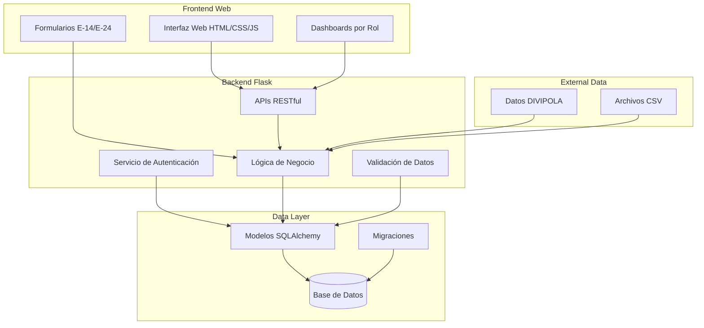
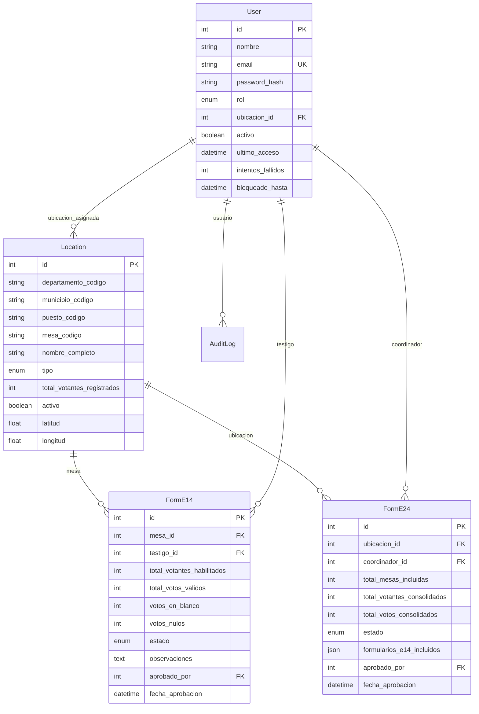
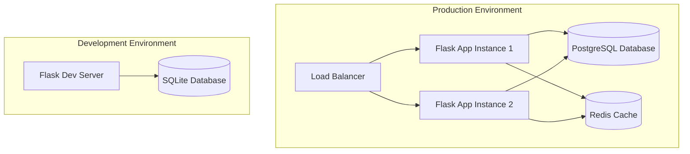

# Diseño del Sistema Electoral

## Overview

El Sistema Electoral será una aplicación web Flask desarrollada desde cero que implementará una arquitectura modular con autenticación JWT, base de datos SQLite/PostgreSQL, y APIs RESTful. El sistema se diseñará para manejar la jerarquía electoral colombiana basada en DIVIPOLA y proporcionará interfaces específicas para cada rol de usuario. Este proyecto se construirá completamente nuevo siguiendo las mejores prácticas de desarrollo web moderno.

### Enfoque de Desarrollo Desde Cero

Este proyecto se desarrollará completamente nuevo con las siguientes consideraciones:

- **Arquitectura Limpia**: Implementación de una arquitectura modular y escalable desde el inicio
- **Mejores Prácticas**: Uso de patrones de diseño modernos y estándares de la industria
- **Seguridad por Diseño**: Implementación de medidas de seguridad desde la fase de desarrollo
- **Testing Integral**: Desarrollo guiado por pruebas (TDD) para garantizar calidad
- **Documentación Completa**: Documentación técnica y de usuario desde el inicio
- **Escalabilidad**: Diseño preparado para manejar grandes volúmenes de datos
- **Mantenibilidad**: Código limpio y bien estructurado para facilitar mantenimiento futuro

## Architecture

### Arquitectura General



### Arquitectura de Seguridad


## Components and Interfaces

### 1. Modelos de Datos (SQLAlchemy)

#### User Model
```python
class User(BaseModel):
    - nombre: String(100)
    - email: String(120) [unique, indexed]
    - password_hash: String(255)
    - rol: Enum(UserRole) [indexed]
    - ubicacion_id: ForeignKey(Location)
    - activo: Boolean [default=True, indexed]
    - ultimo_acceso: DateTime
    - intentos_fallidos: Integer [default=0]
    - bloqueado_hasta: DateTime
```

#### Location Model
```python
class Location(BaseModel):
    - departamento_codigo: String(10) [indexed]
    - municipio_codigo: String(10) [indexed]
    - puesto_codigo: String(10) [indexed]
    - mesa_codigo: String(10) [indexed]
    - nombre_completo: String(200)
    - tipo: Enum(LocationType)
    - total_votantes_registrados: Integer
    - activo: Boolean [default=True]
    - latitud: Float
    - longitud: Float
```

#### FormE14 Model
```python
class FormE14(BaseModel):
    - mesa_id: ForeignKey(Location)
    - testigo_id: ForeignKey(User)
    - total_votantes_habilitados: Integer
    - total_votos_validos: Integer
    - votos_en_blanco: Integer
    - votos_nulos: Integer
    - estado: Enum(FormStatus)
    - observaciones: Text
    - aprobado_por: ForeignKey(User)
    - fecha_aprobacion: DateTime
```

#### FormE24 Model
```python
class FormE24(BaseModel):
    - ubicacion_id: ForeignKey(Location)
    - coordinador_id: ForeignKey(User)
    - total_mesas_incluidas: Integer
    - total_votantes_consolidados: Integer
    - total_votos_consolidados: Integer
    - estado: Enum(FormStatus)
    - formularios_e14_incluidos: JSON
    - aprobado_por: ForeignKey(User)
    - fecha_aprobacion: DateTime
```

### 2. Servicios de Negocio

#### AuthService
- `authenticate_user(email, password)`: Autenticación de usuarios
- `generate_tokens(user_id)`: Generación de tokens JWT
- `refresh_access_token(user_id)`: Renovación de tokens
- `logout_user(jti)`: Invalidación de tokens
- `reset_password(email)`: Reseteo de contraseñas

#### LocationService
- `get_hierarchy_by_user(user)`: Obtener jerarquía accesible
- `import_divipola_data(csv_file)`: Importar datos DIVIPOLA
- `create_location_hierarchy()`: Crear estructura jerárquica
- `validate_location_codes()`: Validar códigos DIVIPOLA

#### FormService
- `create_e14_form(data, testigo_id)`: Crear formulario E-14
- `validate_e14_data(data)`: Validar datos E-14
- `approve_e14_form(form_id, coordinator_id)`: Aprobar E-14
- `create_e24_consolidation(location_id, coordinator_id)`: Crear E-24
- `detect_discrepancies(forms)`: Detectar discrepancias

### 3. APIs RESTful

#### Authentication APIs
- `POST /api/auth/login`: Autenticación de usuarios
- `POST /api/auth/refresh`: Renovación de tokens
- `POST /api/auth/logout`: Cerrar sesión
- `GET /api/auth/profile`: Obtener perfil de usuario

#### Location APIs
- `GET /api/departamentos`: Listar departamentos
- `GET /api/departamentos/{id}/municipios`: Municipios por departamento
- `GET /api/municipios/{id}/puestos`: Puestos por municipio
- `GET /api/puestos/{id}/mesas`: Mesas por puesto

#### Form APIs
- `GET /api/forms/e14`: Listar formularios E-14
- `POST /api/forms/e14`: Crear formulario E-14
- `PUT /api/forms/e14/{id}`: Actualizar formulario E-14
- `POST /api/forms/e14/{id}/approve`: Aprobar formulario E-14
- `GET /api/forms/e24`: Listar formularios E-24
- `POST /api/forms/e24`: Crear formulario E-24

### 4. Interfaces Web

#### Login Interface
- Formulario de autenticación con email/password
- Validación client-side y server-side
- Manejo de errores y mensajes flash
- Redirect automático según rol

#### Dashboard Interfaces
- **Testigo Dashboard**: Formularios E-14, estado de envíos
- **Coordinador Puesto Dashboard**: Aprobación E-14, creación E-24
- **Coordinador Municipal Dashboard**: Consolidación municipal, supervisión
- **Coordinador Departamental Dashboard**: Reportes departamentales, supervisión general

## Data Models

### Modelo de Datos Relacional



### Enumeraciones

```python
class UserRole(Enum):
    TESTIGO_ELECTORAL = "testigo_electoral"
    COORDINADOR_PUESTO = "coordinador_puesto"
    COORDINADOR_MUNICIPAL = "coordinador_municipal"
    COORDINADOR_DEPARTAMENTAL = "coordinador_departamental"
    AUDITOR = "auditor"
    SISTEMAS = "sistemas"

class LocationType(Enum):
    DEPARTAMENTO = "departamento"
    MUNICIPIO = "municipio"
    PUESTO = "puesto"
    MESA = "mesa"

class FormStatus(Enum):
    DRAFT = "borrador"
    SUBMITTED = "enviado"
    UNDER_REVIEW = "en_revision"
    APPROVED = "aprobado"
    REJECTED = "rechazado"
```

## Error Handling

### Estrategia de Manejo de Errores

1. **Validación de Entrada**
   - Validación client-side con JavaScript
   - Validación server-side con decoradores Flask
   - Sanitización de datos de entrada
   - Mensajes de error específicos y útiles

2. **Errores de Autenticación**
   - Manejo de credenciales inválidas
   - Gestión de tokens expirados
   - Bloqueo automático por intentos fallidos
   - Logging de intentos de acceso no autorizado

3. **Errores de Base de Datos**
   - Manejo de transacciones con rollback
   - Validación de integridad referencial
   - Recuperación de errores de conexión
   - Backup automático antes de operaciones críticas

4. **Errores de API**
   - Códigos de estado HTTP apropiados
   - Respuestas JSON estructuradas
   - Rate limiting para prevenir abuso
   - Logging detallado de errores

### Códigos de Error Estándar

```python
ERROR_CODES = {
    'AUTH_001': 'Credenciales inválidas',
    'AUTH_002': 'Usuario bloqueado',
    'AUTH_003': 'Token expirado',
    'PERM_001': 'Acceso no autorizado',
    'PERM_002': 'Ubicación no accesible',
    'FORM_001': 'Datos de formulario inválidos',
    'FORM_002': 'Formulario ya existe',
    'DATA_001': 'Error de integridad de datos',
    'SYS_001': 'Error interno del servidor'
}
```

## Testing Strategy

### Estrategia de Pruebas

1. **Unit Tests**
   - Modelos de datos (User, Location, Forms)
   - Servicios de negocio (AuthService, FormService)
   - Validadores y utilidades
   - Cobertura mínima: 80%

2. **Integration Tests**
   - APIs RESTful completas
   - Flujos de autenticación
   - Operaciones de base de datos
   - Integración entre servicios

3. **End-to-End Tests**
   - Flujos completos de usuario
   - Creación y aprobación de formularios
   - Navegación entre dashboards
   - Procesos de consolidación

4. **Security Tests**
   - Pruebas de penetración básicas
   - Validación de tokens JWT
   - Pruebas de inyección SQL
   - Verificación de permisos

### Herramientas de Testing

- **pytest**: Framework principal de testing
- **pytest-flask**: Extensión para testing Flask
- **factory_boy**: Generación de datos de prueba
- **requests**: Testing de APIs
- **selenium**: Testing end-to-end (opcional)

### Datos de Prueba

- **Usuarios de prueba** para cada rol
- **Datos DIVIPOLA** de muestra (Florencia, Caquetá)
- **Formularios E-14/E-24** de ejemplo
- **Escenarios de discrepancias** para testing

## Deployment Architecture

### Arquitectura de Despliegue



### Configuraciones por Ambiente

1. **Development**
   - SQLite database
   - Debug mode enabled
   - Hot reload
   - Detailed logging

2. **Testing**
   - In-memory database
   - Mock external services
   - Comprehensive logging
   - Test data fixtures

3. **Production**
   - PostgreSQL database
   - HTTPS enforced
   - Error monitoring
   - Performance optimization

## Security Design

### Modelo de Seguridad

1. **Autenticación**
   - JWT tokens con expiración
   - Refresh tokens para renovación
   - Cookies HttpOnly para web
   - Rate limiting en endpoints de auth

2. **Autorización**
   - Control de acceso basado en roles (RBAC)
   - Permisos jerárquicos por ubicación
   - Validación de permisos en cada request
   - Principio de menor privilegio

3. **Protección de Datos**
   - Encriptación de contraseñas con scrypt
   - Sanitización de inputs
   - Validación de tipos de datos
   - Logging de actividad sensible

## Performance Considerations

### Optimizaciones de Rendimiento

1. **Base de Datos**
   - Índices en campos de consulta frecuente
   - Paginación en consultas grandes
   - Lazy loading en relaciones
   - Connection pooling

2. **APIs**
   - Caché de respuestas frecuentes
   - Compresión de respuestas JSON
   - Rate limiting por usuario
   - Filtros eficientes

3. **Frontend**
   - Carga lazy de componentes
   - Caché de datos estáticos
   - Optimización de assets
   - Progressive Web App (PWA) features

## Integration Points

### Integraciones Externas

1. **Datos DIVIPOLA**
   - Importación desde archivos CSV oficiales
   - Validación de códigos geográficos
   - Actualización periódica de datos
   - Sincronización con cambios oficiales

2. **Sistemas de Reportes**
   - Exportación a formatos estándar (CSV, JSON, PDF)
   - APIs para sistemas externos
   - Webhooks para notificaciones
   - Integración con sistemas de auditoría

3. **Notificaciones**
   - Email notifications para eventos críticos
   - Alertas en tiempo real para discrepancias
   - Notificaciones push para móviles
   - SMS para alertas urgentes (futuro)

## Monitoring and Logging

### Estrategia de Monitoreo

1. **Application Monitoring**
   - Health checks automáticos
   - Métricas de rendimiento
   - Alertas de disponibilidad
   - Dashboards de monitoreo

2. **Security Monitoring**
   - Detección de intentos de acceso no autorizado
   - Monitoreo de patrones anómalos
   - Alertas de seguridad
   - Auditoría de cambios críticos

3. **Business Monitoring**
   - Progreso del proceso electoral
   - Estadísticas de participación
   - Detección de discrepancias
   - Reportes de estado en tiempo real

### Logging Strategy

```python
LOGGING_LEVELS = {
    'DEBUG': 'Información detallada para desarrollo',
    'INFO': 'Eventos normales del sistema',
    'WARNING': 'Situaciones que requieren atención',
    'ERROR': 'Errores que afectan funcionalidad',
    'CRITICAL': 'Errores que requieren intervención inmediata'
}
```

## Scalability Design

### Diseño para Escalabilidad

1. **Horizontal Scaling**
   - Múltiples instancias de Flask
   - Load balancer para distribución
   - Sesiones stateless con JWT
   - Base de datos compartida

2. **Vertical Scaling**
   - Optimización de consultas
   - Índices de base de datos
   - Caché en memoria
   - Connection pooling

3. **Data Partitioning**
   - Particionamiento por departamento
   - Archivado de datos históricos
   - Replicación de lectura
   - Backup incremental

## Technology Stack

### Stack Tecnológico

1. **Backend**
   - **Framework**: Flask 2.3+
   - **Database**: SQLite (dev) / PostgreSQL (prod)
   - **ORM**: SQLAlchemy
   - **Authentication**: Flask-JWT-Extended
   - **Validation**: Marshmallow
   - **Migration**: Flask-Migrate

2. **Frontend**
   - **Templates**: Jinja2
   - **CSS Framework**: Bootstrap 5
   - **JavaScript**: Vanilla JS + Fetch API
   - **Icons**: Font Awesome
   - **Charts**: Chart.js

3. **Infrastructure**
   - **Web Server**: Gunicorn (prod) / Flask dev server (dev)
   - **Reverse Proxy**: Nginx (prod)
   - **Cache**: Redis (prod)
   - **Monitoring**: Prometheus + Grafana (prod)

4. **Development Tools**
   - **Testing**: pytest + pytest-flask
   - **Code Quality**: flake8 + black
   - **Documentation**: Sphinx
   - **Version Control**: Git

## Implementation Phases

### Fases de Implementación (Proyecto Desde Cero)

1. **Fase 1: Configuración Inicial**
   - Configuración completa del proyecto Flask desde cero
   - Estructura de directorios y entorno virtual
   - Configuraciones para desarrollo, testing y producción
   - Modelos de datos fundamentales (User, Location)

2. **Fase 2: Autenticación y Autorización**
   - Sistema completo de autenticación JWT
   - Control de acceso basado en roles
   - APIs básicas de ubicaciones geográficas
   - Interfaz web básica y dashboards

3. **Fase 3: Gestión de Formularios E-14**
   - Modelos y validaciones para formularios E-14
   - APIs completas para gestión de formularios
   - Interfaz web para captura y aprobación
   - Sistema de permisos por ubicación

4. **Fase 4: Consolidación y Formularios E-24**
   - Modelos para consolidaciones E-24
   - Lógica automática de consolidación
   - Detección de discrepancias
   - APIs y interfaces para consolidaciones

5. **Fase 5: Reportes, Seguridad y Producción**
   - Sistema completo de auditoría y reportes
   - Medidas de seguridad avanzadas
   - Optimizaciones de rendimiento
   - Configuración de producción y despliegue